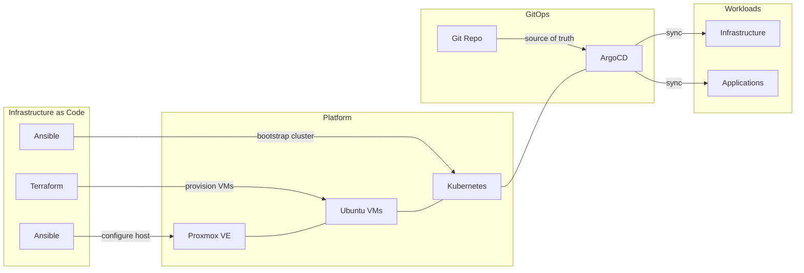

# Homelab

Infrastructure-as-code for my homelab. Ansible configures Proxmox hosts, Terraform provisions VMs, Ansible bootstraps Kubernetes clusters, and ArgoCD manages workloads via GitOps.

**[Read the full documentation](https://kyleseneker.github.io/homelab/)** -- or run `make docs-serve` to browse locally.

## At a Glance

| Host | Hardware | Role | Clusters |
|------|----------|------|----------|
| homelabpve01 | Minisforum MS-01 (64GB) | Proxmox VE | homelabk8s01 |

| Cluster | Nodes | Purpose |
|---------|-------|---------|
| homelabk8s01 | 1 control plane + 2 workers | \*arr media stack, Jellyfin |

## Architecture



| Category | Components |
|----------|------------|
| Cluster | kubeadm, Cilium CNI |
| GitOps | ArgoCD, Sealed Secrets, Renovate |
| Networking | MetalLB, ingress-nginx, cert-manager |
| Storage | NFS dynamic provisioning |
| Auth | Authentik SSO (forward-auth + OIDC) |
| Monitoring | Prometheus, Grafana, Loki, Alertmanager, Exportarr, Uptime Kuma |
| Backups | Velero, MinIO |
| Automation | Reloader, Descheduler, Renovate |
| Network Security | CiliumNetworkPolicies (namespace isolation) |
| Hardware | Intel iGPU passthrough |

## Quick Start

```bash
make deps              # install Ansible Galaxy collections
make pve-configure     # configure Proxmox host
make k8s-deploy        # provision VMs + bootstrap K8s + install ArgoCD
make k8s-kubeconfig    # copy kubeconfig locally
```

See the [full quick start guide](docs/getting-started/quick-start.md) for configuration steps and secret sealing.

## Documentation

| Section | Description |
|---------|-------------|
| [Getting Started](docs/getting-started/quick-start.md) | Prerequisites, deployment walkthrough, configuration reference |
| [Architecture](docs/architecture/overview.md) | System design, GitOps flow, networking, storage, monitoring |
| [Apps](docs/apps/index.md) | Per-app details for the \*arr stack, Jellyfin, Homepage, Exportarr, and Uptime Kuma |
| [Infrastructure](docs/infrastructure/index.md) | Every infrastructure component: charts, config, and integration |
| [Runbooks](docs/runbooks/disaster-recovery.md) | Operational procedures: DR, upgrades, troubleshooting |
| [Reference](docs/reference/commands.md) | Makefile commands, service URLs, repo layout |
