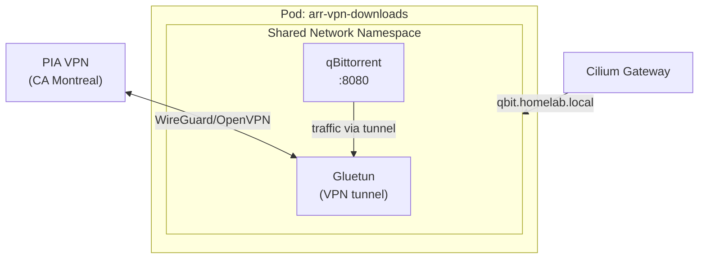

# Downloads (Gluetun + qBittorrent)

This deployment runs a multi-container pod combining a VPN sidecar (Gluetun) with a torrent download client (qBittorrent). Both containers share a single network namespace, so all download traffic is routed through the Private Internet Access (PIA) VPN tunnel.

## Details

| Property | Value |
|----------|-------|
| Helm chart | `app-template` v4.6.2 ([bjw-s](https://bjw-s-labs.github.io/helm-charts)) |
| Namespace | `arr` |
| ArgoCD app | `arr-vpn-downloads` |
| HTTPRoute | `qbit.homelab.local` |
| Sync wave | 1 |

### Containers

| Container | Image | Port | Role |
|-----------|-------|------|------|
| `gluetun` | `qmcgaw/gluetun:v3.41.1` | -- | VPN sidecar (PIA) |
| `qbittorrent` | `lscr.io/linuxserver/qbittorrent:5.1.4` | 8080 | Torrent client |

### Storage

| Volume | Type | Size | Mount Path | Scope |
|--------|------|------|------------|-------|
| `gluetun-config` | PVC (`nfs-client`) | 256Mi | `/gluetun` | All containers |
| `qbit-config` | PVC (`nfs-client`) | 1Gi | `/config` | qBittorrent only |
| `data` | PVC (existing `arr-data`) | -- | `/data` | All containers |

### Resources

| Container | CPU Request | Memory Request | Memory Limit |
|-----------|-------------|----------------|--------------|
| `gluetun` | 50m | 128Mi | 256Mi |
| `qbittorrent` | 100m | 256Mi | 1Gi |

## Pod Architecture

The two containers share a network namespace. Gluetun establishes the VPN tunnel and acts as the network gateway for qBittorrent. qBittorrent depends on Gluetun and will not start until it is healthy.



## Key Configuration

### Gluetun

- `VPN_SERVICE_PROVIDER`: `private internet access`
- `SERVER_REGIONS`: `CA Montreal`
- `VPN_PORT_FORWARDING`: `on` (PIA assigns the torrent listening port dynamically)
- `FIREWALL_INPUT_PORTS`: `8080` (allows ingress to reach the qBittorrent UI)
- `DOT`: `off`
- Requires `NET_ADMIN` capability for VPN tunnel creation.
- VPN credentials are injected from ExternalSecret `vpn-credentials` (synced from Vault).
- Liveness probe runs `/gluetun-entrypoint healthcheck` every 60 seconds (initial delay 60s).
- Startup probe allows up to 60 failures at 5-second intervals (5 minutes).

### qBittorrent

- `WEBUI_PORT`: `8080`
- Environment variables from ConfigMap `arr-env` (TZ, PUID, PGID).
- Depends on `gluetun` -- will not start until Gluetun is ready.

### Pod Security

```yaml
defaultPodOptions:
  securityContext:
    sysctls:
      - name: net.ipv4.conf.all.src_valid_mark
        value: "1"
```

This sysctl is required for the VPN routing to function correctly.

## Post-Deploy Setup

### qBittorrent

1. Retrieve the temporary admin password from the container logs:

    ```bash
    kubectl logs -n arr -l app.kubernetes.io/instance=arr-vpn-downloads -c qbittorrent | grep "temporary password"
    ```

2. Log in at `https://qbit.homelab.local` with username `admin` and the temporary password.
3. Change the admin password immediately (Settings > Web UI > Authentication).
4. Configure default save path to `/data/torrents`.
5. Create categories `tv` and `movies` with appropriate save paths.

## Dependencies

| Dependency | Purpose |
|------------|---------|
| Sonarr | Sends TV download requests to qBittorrent |
| Radarr | Sends movie download requests to qBittorrent |
| Unpackerr | Monitors completed downloads and extracts compressed archives |
| VPN credentials | ExternalSecret `vpn-credentials` must exist in the `arr` namespace (synced from Vault) |

## Upstream

- Gluetun: [https://github.com/qdm12/gluetun](https://github.com/qdm12/gluetun)
- qBittorrent: [https://www.qbittorrent.org](https://www.qbittorrent.org)
