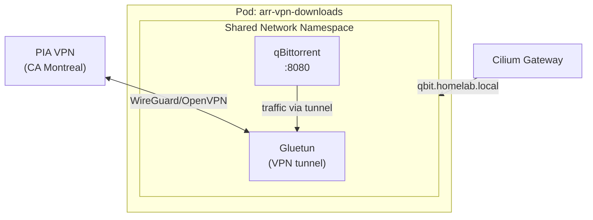

# Downloads (Gluetun + qBittorrent)

This deployment runs a multi-container pod combining a VPN sidecar (Gluetun) with a torrent download client (qBittorrent). Gluetun runs as a restartable init sidecar and both containers share a single network namespace, so all download traffic is routed through the Private Internet Access (PIA) VPN tunnel.

## Details

| Property | Value |
|----------|-------|
| Helm chart | `app-template` v4.6.2 ([bjw-s](https://bjw-s-labs.github.io/helm-charts)) |
| Namespace | `arr` |
| ArgoCD app | `arr-vpn-downloads` |
| HTTPRoute | `qbit.homelab.local` |

### Containers

| Container | Image | Port | Role |
|-----------|-------|------|------|
| `gluetun` | `qmcgaw/gluetun` | -- | VPN sidecar (PIA) |
| `qbittorrent` | `lscr.io/linuxserver/qbittorrent` | 8080 | Torrent client |

### Storage

| Volume | Type | Size | Mount Path | Scope |
|--------|------|------|------------|-------|
| `gluetun-config` | PVC (`nfs-client`) | 256Mi | `/gluetun` | All containers |
| `qbit-config` | PVC (`nfs-client`) | 1Gi | `/config` | qBittorrent only |
| `data` | PVC (existing `arr-data`) | -- | `/data` | All containers |

### Resources

| Container | CPU Request | Memory Request | Memory Limit |
|-----------|-------------|----------------|--------------|
| `gluetun` | 50m | 128Mi | 256Mi |
| `qbittorrent` | 100m | 256Mi | 1Gi |

## Pod Architecture

Gluetun is a native sidecar (`initContainers`, `restartPolicy: Always`). Its startup healthcheck must succeed before Kubernetes starts qBittorrent. The sidecar stays running alongside the client and its firewall handles tunnel failures. Verify fail-closed behavior with an explicit VPN outage test; startup ordering alone does not prove leak prevention.


```mermaid
flowchart TB
    subgraph pod["Pod: arr-vpn-downloads"]
        direction TB
        subgraph netns["Shared Network Namespace"]
            gluetun["Gluetun\n(VPN tunnel)"]
            qbit["qBittorrent\n:8080"]
        end
    end

    vpn["PIA VPN\n(CA Montreal)"] <-->|"WireGuard/OpenVPN"| gluetun
    qbit -->|"traffic via tunnel"| gluetun
    gateway["Cilium Gateway"] -->|"qbit.homelab.local"| netns
```

## Key Configuration

### Gluetun

- `VPN_SERVICE_PROVIDER`: `private internet access`
- `SERVER_REGIONS`: `CA Montreal`
- `VPN_PORT_FORWARDING`: `on` (PIA assigns the torrent listening port dynamically)
- `FIREWALL_INPUT_PORTS`: `8080` (allows ingress to reach the qBittorrent UI)
- `DOT`: `off`
- Requires `NET_ADMIN` capability for VPN tunnel creation.
- VPN credentials are injected from ExternalSecret `vpn-credentials` (synced from Vault).
- Liveness probe runs `/gluetun-entrypoint healthcheck` every 60 seconds (initial delay 60s).
- Startup probe allows up to 60 failures at 5-second intervals (5 minutes).

### qBittorrent

- `WEBUI_PORT`: `8080`
- Environment variables from ConfigMap `arr-env` (TZ, PUID, PGID).
- Startup is gated by Gluetun's native-sidecar startup probe. The former chart `dependsOn` value was ignored.

### Pod Security

```yaml
defaultPodOptions:
  securityContext:
    sysctls:
      - name: net.ipv4.conf.all.src_valid_mark
        value: "1"
```

This sysctl is required for the VPN routing to function correctly.

## Post-Deploy Verification

The init container seeds a new qBittorrent configuration from the PBKDF2 hash in `qbittorrent-credentials`. It does not overwrite an existing configuration. Keep the username/password/hash synchronized in Vault when rotating; do not rely on a temporary password printed in logs.

`QBittorrentConfig` manages categories, save paths, seeding limits, and authentication preferences. Sonarr, Radarr, and the operator authenticate using `qbittorrent-credentials`; pod-network authentication bypass is disabled. The web route passes through the Authentik outpost and qBittorrent retains its own login.

Verify the CR is ready, a download-client connection test succeeds, and the torrent client's external address is the VPN address. PIA port forwarding is enabled, but this repository does not yet prove that the assigned port is synchronized into qBittorrent's listen-port setting; validate that separately before claiming incoming peer connectivity.

## Dependencies

| Dependency | Purpose |
|------------|---------|
| Sonarr | Sends TV download requests to qBittorrent |
| Radarr | Sends movie download requests to qBittorrent |
| Unpackerr | Monitors completed downloads and extracts compressed archives |
| VPN credentials | ExternalSecret `vpn-credentials` must exist in the `arr` namespace (synced from Vault) |

## Upstream

- Gluetun: [https://github.com/qdm12/gluetun](https://github.com/qdm12/gluetun)
- qBittorrent: [https://www.qbittorrent.org](https://www.qbittorrent.org)
