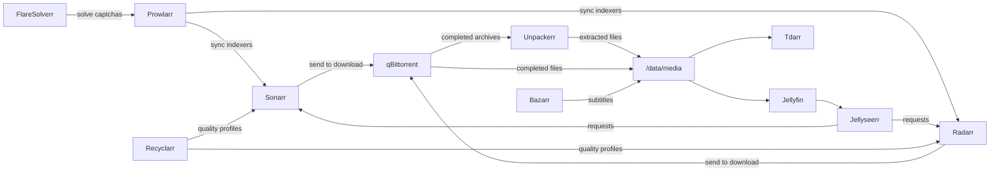

# Applications

The homelab runs an automated media management stack commonly referred to as the *arr stack. All applications are deployed into the `arr` namespace on Kubernetes via ArgoCD, using the [bjw-s app-template](https://bjw-s-labs.github.io/helm-charts) Helm chart (v4.6.2). Ingress is provided by nginx with TLS certificates issued by cert-manager (`homelab-ca-issuer`).

## Shared Configuration

All *arr applications receive common environment variables from the `arr-env` ConfigMap:

| Variable | Value |
|----------|-------|
| `TZ` | `America/Chicago` |
| `PUID` | `977` |
| `PGID` | `988` |

Most applications share the `arr-data` PersistentVolumeClaim for media and download storage, ensuring a unified `/data` directory structure across the stack.

## Data Flow

The diagram below shows how data moves through the stack, from media requests through downloading and processing to playback.

## Application Summary

| Application | Ingress URL | Description | Image |
|-------------|-------------|-------------|-------|
| [Jellyfin](jellyfin.md) | `jellyfin.homelab.local` | Media server for movies, TV, and music | `lscr.io/linuxserver/jellyfin:10.11.6` |
| [Sonarr](sonarr.md) | `sonarr.homelab.local` | TV series management and automation | `lscr.io/linuxserver/sonarr:4.0.17` |
| [Radarr](radarr.md) | `radarr.homelab.local` | Movie management and automation | `lscr.io/linuxserver/radarr:6.0.4` |
| [Prowlarr](prowlarr.md) | `prowlarr.homelab.local` | Centralized indexer manager | `lscr.io/linuxserver/prowlarr:2.3.0` |
| [Bazarr](bazarr.md) | `bazarr.homelab.local` | Automated subtitle downloading | `lscr.io/linuxserver/bazarr:1.5.6` |
| [Jellyseerr](jellyseerr.md) | `jellyseerr.homelab.local` | Media request management | `fallenbagel/jellyseerr:2.7.3` |
| [Downloads](downloads.md) | `qbit.homelab.local` | VPN-routed torrent client (qBittorrent) | `qmcgaw/gluetun:v3.41.1`, `lscr.io/linuxserver/qbittorrent:5.1.4` |
| [Recyclarr](recyclarr.md) | -- | Quality profile sync (CronJob) | `ghcr.io/recyclarr/recyclarr:8.5.1` |
| [Tdarr](tdarr.md) | `tdarr.homelab.local` | Automated media transcoding | `ghcr.io/haveagitgat/tdarr:2.65.01` |
| [Unpackerr](unpackerr.md) | -- | Automatic extraction of compressed downloads | `ghcr.io/unpackerr/unpackerr:v0.15.2` |
| [Exportarr](exportarr.md) | -- | Prometheus metrics exporter for *arr apps | `ghcr.io/onedr0p/exportarr:v2.3.0` |
| [FlareSolverr](flaresolverr.md) | -- | Captcha-solving proxy for Prowlarr indexers | `ghcr.io/flaresolverr/flaresolverr:v3.4.6` |
| [Homepage](homepage.md) | `home.homelab.local` | Dashboard aggregating all services | `ghcr.io/gethomepage/homepage:v1.11.0` |
| [Uptime Kuma](uptime-kuma.md) | `status.homelab.local` | Synthetic monitoring and status page | `louislam/uptime-kuma:2.2.1` |

## ArgoCD Sync Waves

All *arr applications deploy at sync wave **1**. Homepage and Uptime Kuma deploy at sync wave **2** so that service endpoints are available before they attempt to query them.
