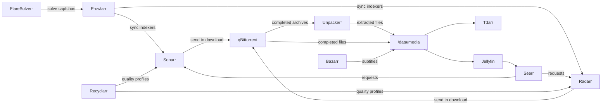

# Applications

The homelab runs an automated media management stack commonly referred to as the *arr stack. Most applications are deployed into the `arr` namespace via ArgoCD, using the [bjw-s app-template](https://bjw-s-labs.github.io/helm-charts) Helm chart (v4.6.2); Uptime Kuma runs in `monitoring` and OpenClaw in `openclaw`. Routing is provided by Cilium Gateway API with TLS certificates issued by cert-manager (`homelab-ca-issuer`).

!!! warning "No edge authentication"
    Apps reachable at `*.homelab.local` have no authentication in front of them. See [Auth & SSO](../architecture/auth.md) for why and what is affected.

## Shared Configuration

All *arr applications receive common environment variables from the `arr-env` ConfigMap:

| Variable | Value |
|----------|-------|
| `TZ` | `America/Chicago` |
| `PUID` | `977` |
| `PGID` | `988` |

Most applications share the `arr-data` PersistentVolumeClaim for media and download storage, ensuring a unified `/data` directory structure across the stack.

## Data Flow

The diagram below shows how data moves through the stack, from media requests through downloading and processing to playback.

```mermaid
flowchart LR
    Prowlarr -->|"sync indexers"| Sonarr
    Prowlarr -->|"sync indexers"| Radarr
    Seerr -->|"requests"| Sonarr
    Seerr -->|"requests"| Radarr
    Sonarr -->|"send to download"| Downloads["qBittorrent"]
    Radarr -->|"send to download"| Downloads
    Downloads -->|"completed archives"| Unpackerr
    Unpackerr -->|"extracted files"| Media["/data/media"]
    Downloads -->|"completed files"| Media
    Media --> Jellyfin
    Media --> Tdarr
    Bazarr -->|"subtitles"| Media
    Recyclarr -->|"quality profiles"| Sonarr
    Recyclarr -->|"quality profiles"| Radarr
    FlareSolverr -->|"solve captchas"| Prowlarr
    Jellyfin --> Seerr
```

## Application Summary

Image tags are Renovate-managed and change weekly. The manifests under `k8s/clusters/homelabk8s01/apps/` are the source of truth for the version actually deployed.

| Application | Namespace | URL | Description | Image |
|-------------|-----------|-----|-------------|-------|
| [Jellyfin](jellyfin.md) | `arr` | `jellyfin.homelab.local` | Media server for movies, TV, and music | `lscr.io/linuxserver/jellyfin` |
| [Sonarr](sonarr.md) | `arr` | `sonarr.homelab.local` | TV series management and automation | `lscr.io/linuxserver/sonarr` |
| [Radarr](radarr.md) | `arr` | `radarr.homelab.local` | Movie management and automation | `lscr.io/linuxserver/radarr` |
| [Prowlarr](prowlarr.md) | `arr` | `prowlarr.homelab.local` | Centralized indexer manager | `lscr.io/linuxserver/prowlarr` |
| [Bazarr](bazarr.md) | `arr` | `bazarr.homelab.local` | Automated subtitle downloading | `lscr.io/linuxserver/bazarr` |
| [Seerr](seerr.md) | `arr` | `seerr.homelab.local` | Media request management | `seerr-chart` (own chart) |
| [Downloads](downloads.md) | `arr` | `qbit.homelab.local` | VPN-routed torrent client (qBittorrent) | `qmcgaw/gluetun`, `lscr.io/linuxserver/qbittorrent` |
| [Recyclarr](recyclarr.md) | `arr` | -- | Quality profile sync (CronJob) | `ghcr.io/recyclarr/recyclarr` |
| [Tdarr](tdarr.md) | `arr` | `tdarr.homelab.local` | Automated media transcoding | `ghcr.io/haveagitgat/tdarr` |
| [Unpackerr](unpackerr.md) | `arr` | -- | Automatic extraction of compressed downloads | `ghcr.io/unpackerr/unpackerr` |
| [Exportarr](exportarr.md) | `arr` | -- | Prometheus metrics exporter for *arr apps | `ghcr.io/onedr0p/exportarr` |
| [FlareSolverr](flaresolverr.md) | `arr` | -- | Captcha-solving proxy for Prowlarr indexers | `ghcr.io/flaresolverr/flaresolverr` |
| [Media Operator](media-operator.md) | `arr` | -- | Declarative Sonarr/Radarr/Prowlarr configuration | `media-operator-servarr` (own chart) |
| [Config Backup](config-backup.md) | `arr` | -- | Nightly SQLite dumps of *arr config databases | `alpine` |
| [Homepage](homepage.md) | `arr` | `home.homelab.local` | Dashboard aggregating all services | `ghcr.io/gethomepage/homepage` |
| [Uptime Kuma](uptime-kuma.md) | `monitoring` | `status.homelab.local` | Synthetic monitoring and status page | `louislam/uptime-kuma` |
| [OpenClaw](openclaw.md) | `openclaw` | `openclaw.homelab.local` | AI agents for cluster ops and media management | `ghcr.io/openclaw/openclaw` |

## Deployment Ordering

Each app is an independent ArgoCD Application with no ordering between them -- see [Infrastructure &rarr; Deployment Ordering](../infrastructure/index.md#deployment-ordering). The `arr` namespace, the shared `arr-data` PV, and the `arr-env` ConfigMap are owned by the `arr-prereqs` Application; apps targeting the namespace fail and retry until it exists.
