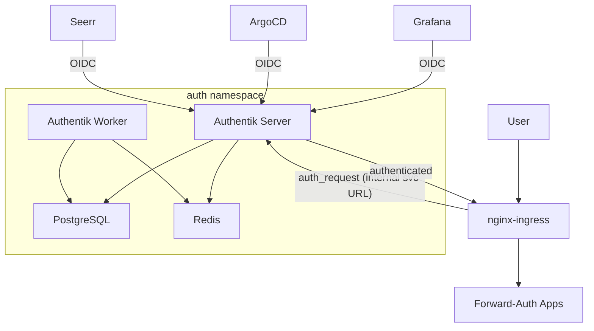

# Authentication & SSO

The homelab uses Authentik as the centralized identity provider, giving every service a single login. Two mechanisms are used depending on the application's capabilities.

## Authentication Flows

### Forward Auth (Domain-Level)

For apps without native SSO support, nginx-ingress performs an `auth_request` subrequest to Authentik's embedded outpost before proxying to the backend. A single domain-level proxy provider covers all `*.homelab.local` subdomains, so adding a new app behind SSO only requires adding ingress annotations.

The `auth-url` annotation points to the embedded outpost's internal service (`ak-outpost-authentik-embedded-outpost.auth.svc.cluster.local:9000`). The `auth-snippet` annotation sets `X-Forwarded-Host` so the outpost can identify the original domain. The `auth-signin` URL uses the external hostname for browser redirects.

The outpost cookie domain is set to `homelab.local`, enabling a single authentication session across all subdomains.

**Protected apps:** Sonarr, Radarr, Prowlarr, Bazarr, Tdarr, qBittorrent, Homepage

### Native OIDC

Apps with built-in OAuth2/OIDC support authenticate directly with Authentik. Each gets its own OAuth2 provider and application in Authentik, with a dedicated client ID and secret.

- **Grafana** -- `auth.generic_oauth` with role mapping (`admin` group -> Admin role)
- **ArgoCD** -- native OIDC via `oidc.config` in `argocd-cm` with RBAC group mapping
- **Seerr** -- configured through its Settings UI

Server-to-server URLs (token, userinfo) use the internal service URL. Browser-facing URLs (authorize) use the external hostname.

### Unprotected Services

| Service | Reason |
|---------|--------|
| Jellyfin | Has its own user auth; media clients (Roku, Apple TV, mobile) can't do browser-based SSO |
| Prometheus | Internal monitoring; forward-auth would break Grafana datasource scraping |
| Alertmanager | Same as Prometheus |
| Authentik | Circular dependency |

## Group-Based Access Control

| Group | Grafana Role | ArgoCD Role | Forward-Auth |
|-------|-------------|-------------|--------------|
| `authentik Admins` | Admin | `role:admin` | Full access |
| (default) | Viewer | Read-only | Full access |

## Resilience

If Authentik goes down, forward-auth apps become inaccessible. OIDC apps (Grafana, ArgoCD) are unaffected and fall back to their own login pages. See the [emergency bypass runbook](../runbooks/authentik-emergency-bypass.md) for recovery procedures.

The `auth` namespace is included in Velero's daily stateful backup and the weekly full-cluster backup.
