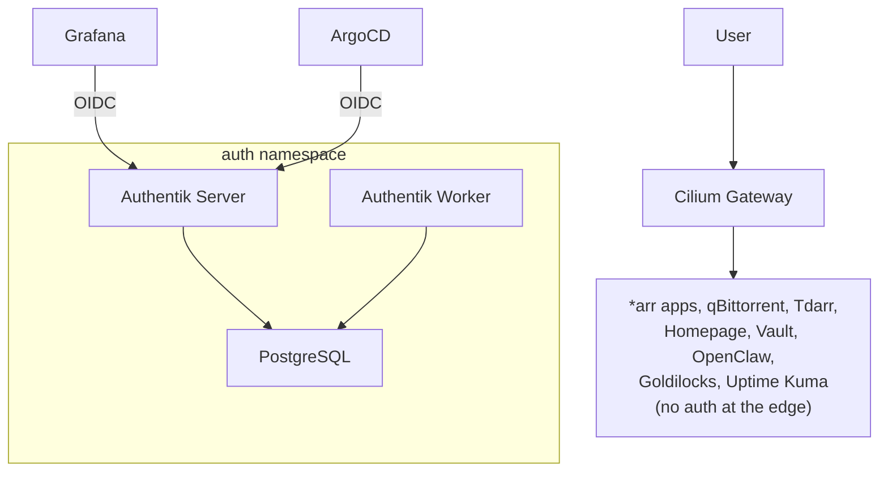

# Authentication & SSO

The homelab uses Authentik as the centralized identity provider. Only applications with native OIDC support currently authenticate against it.

## Authentication Flows

```mermaid
flowchart TB
    subgraph authNS ["auth namespace"]
        AuthentikServer["Authentik Server"]
        AuthentikWorker["Authentik Worker"]
        PostgreSQL["PostgreSQL"]
        AuthentikServer --> PostgreSQL
        AuthentikWorker --> PostgreSQL
    end

    User["User"] --> Gateway["Cilium Gateway"]
    Gateway --> UnprotectedApps["*arr apps, qBittorrent, Tdarr,<br/>Homepage, Vault, OpenClaw,<br/>Goldilocks, Uptime Kuma<br/>(no auth at the edge)"]

    Grafana["Grafana"] -->|"OIDC"| AuthentikServer
    ArgoCD["ArgoCD"] -->|"OIDC"| AuthentikServer
```

Authentik runs its server and worker against a bundled PostgreSQL instance. No Redis is deployed -- the task queue lives in PostgreSQL. The `authentik-external-secret.yml` still pulls a `redis-password` from Vault, which nothing consumes.

### Forward Auth -- Not Currently Implemented

!!! danger "The *arr apps are not behind SSO"
    Every route is served by the Cilium Gateway, and no authentication runs at the edge. Each app's own login, where it has one, is the only control.

    **Reachable on the LAN with no edge auth: Sonarr, Radarr, Prowlarr, Bazarr, Tdarr, qBittorrent, Homepage, Vault, OpenClaw, Goldilocks and Uptime Kuma.** Tdarr serves its API unauthenticated, and the Goldilocks dashboard has no login, so for those two there is no control at any layer.

    Tracked as [K21](../roadmap/assessment.md) in the assessment. Adding it requires an ext_authz path through Cilium's Envoy -- an HTTPRoute has no annotation-based equivalent to a subrequest-style auth hook.

### Native OIDC

Apps with built-in OAuth2/OIDC support authenticate directly with Authentik. Each gets its own OAuth2 provider and application in Authentik, with a dedicated client ID and secret.

- **Grafana** -- `auth.generic_oauth` with role mapping (`admin` group -> Admin role)
- **ArgoCD** -- native OIDC via `oidc.config` in `argocd-cm` with RBAC group mapping
- **Seerr** -- OIDC not yet supported ([seerr-team/seerr#2715](https://github.com/seerr-team/seerr/pull/2715)); authenticates via Jellyfin

Server-to-server URLs (token, userinfo) use the internal service URL. Browser-facing URLs (authorize) use the external hostname.

### Unprotected Services

| Service | Reason |
|---------|--------|
| *arr apps, qBittorrent, Homepage | No edge auth -- see the warning above. Each has its own login |
| Tdarr, Goldilocks | No edge auth, and neither enforces a login of its own |
| Vault | No edge auth; unseal keys and tokens are the only control |
| OpenClaw | No edge auth; its own webhook routes are the only control |
| Uptime Kuma | No edge auth; has its own login |
| Jellyfin | Has its own user auth; media clients (Roku, Apple TV, mobile) can't do browser-based SSO |
| Prometheus | Internal monitoring; edge auth would break Grafana datasource scraping |
| Alertmanager | Same as Prometheus |
| Authentik | Circular dependency |

## Group-Based Access Control

| Group | Grafana Role | ArgoCD Role |
|-------|-------------|-------------|
| `authentik Admins` | Admin | `role:admin` |
| (default) | Viewer | Read-only |

## Resilience

Because no app depends on Authentik at the edge, an Authentik outage does not make any service inaccessible. Grafana and ArgoCD fall back to their own login pages. See the [emergency bypass runbook](../runbooks/authentik-emergency-bypass.md) for recovery procedures.

The `auth` namespace is included in Velero's daily stateful backup and the weekly full-cluster backup.
