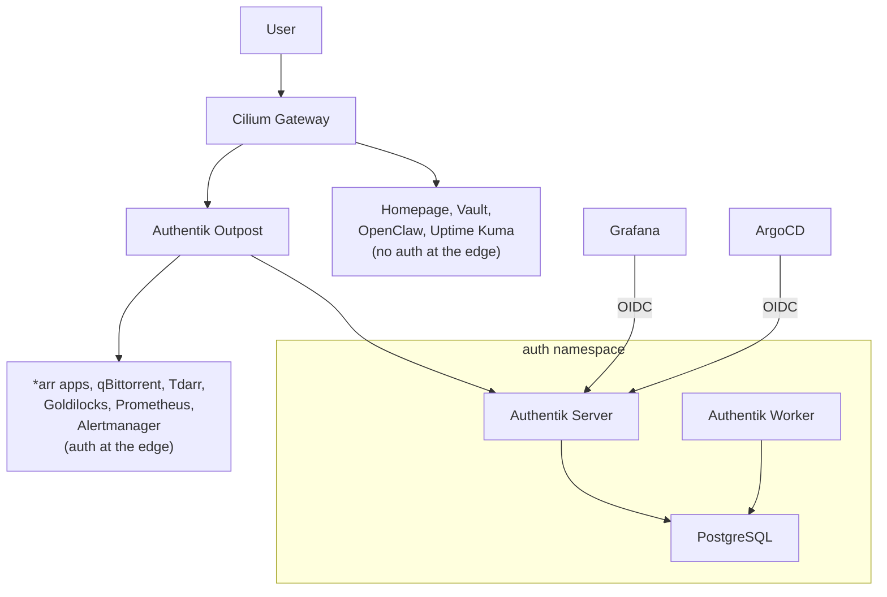

# Authentication & SSO

The homelab uses Authentik as the centralized identity provider. Applications authenticate either through native OIDC or by routing their traffic through Authentik's embedded outpost.

## Authentication Flows

```mermaid
flowchart TB
    subgraph authNS ["auth namespace"]
        AuthentikServer["Authentik Server"]
        AuthentikWorker["Authentik Worker"]
        PostgreSQL["PostgreSQL"]
        AuthentikServer --> PostgreSQL
        AuthentikWorker --> PostgreSQL
    end

    User["User"] --> Gateway["Cilium Gateway"]
    Gateway --> Outpost["Authentik Outpost"]
    Outpost --> ProtectedApps["*arr apps, qBittorrent, Tdarr,<br/>Goldilocks, Prometheus,<br/>Alertmanager<br/>(auth at the edge)"]
    Outpost --> AuthentikServer
    Gateway --> UnprotectedApps["Homepage, Vault,<br/>OpenClaw, Uptime Kuma<br/>(no auth at the edge)"]

    Grafana["Grafana"] -->|"OIDC"| AuthentikServer
    ArgoCD["ArgoCD"] -->|"OIDC"| AuthentikServer
```

Authentik runs its server and worker against a bundled PostgreSQL instance. No Redis is deployed; the task queue lives in PostgreSQL.

### Proxied Auth

Tdarr, Goldilocks, Sonarr, Radarr, Prowlarr, Bazarr, qBittorrent, Prometheus and Alertmanager route through the embedded outpost, which authenticates the browser before proxying to the app. The outpost dispatches on the `Host` header, so one instance serves every protected app. Each app declares a proxy-mode provider in `infrastructure/authentik/blueprints-configmap.yml`.

Because the outpost originates the proxied request, it needs its own network path to each backend -- ingress on the app's namespace and egress from `auth`. Without both, the browser gets the login redirect and then hangs. See the [runbook](../runbooks/adding-app-to-sso.md).

Grafana reads Prometheus and Alertmanager over their in-cluster Services, so proxying their web UIs does not affect scraping or dashboards.

The *arr apps and qBittorrent exempt `/api/`, `/feed/` and `/ping` from the proxy via `skip_path_regex`, because mobile and scripted clients cannot complete a browser login. These paths depend on each application's own authentication. The *arr APIs use API keys; qBittorrent uses its Web API session authentication. Verify unauthorized access fails per application rather than assuming every endpoint returns `401`.

!!! warning "Still open on the LAN"
    **Reachable with no edge auth: Homepage, Vault, OpenClaw and Uptime Kuma.** Their native controls remain the access boundary. Vault keeps an independent recovery login because Authentik's credentials also depend on Vault and External Secrets.

### Native OIDC

Apps with built-in OAuth2/OIDC support authenticate directly with Authentik. Each gets its own OAuth2 provider and application in Authentik, with a dedicated client ID and secret.

- **Grafana** -- `auth.generic_oauth` with role mapping (`authentik Admins` group -> Admin role)
- **ArgoCD** -- native OIDC via `oidc.config` in `argocd-cm` with RBAC group mapping
- **Seerr** -- the deployed configuration authenticates via Jellyfin

Grafana's token and userinfo URLs use the internal Service over HTTP, with Cilium policies controlling reachability. Its browser authorization URL uses the external hostname. ArgoCD uses the external HTTPS issuer and the CA distributed by trust-manager; it does not use Grafana's split URL configuration.

### Unprotected Services

| Service | Reason |
|---------|--------|
| Homepage | No edge auth; exposes service links and operational widget data to the LAN |
| Vault | Cannot use Authentik -- Authentik's own secrets come from Vault, so this would be circular. Token auth is the control |
| OpenClaw | Uses its own gateway and webhook authentication; see the [OpenClaw configuration](../apps/openclaw.md) |
| Uptime Kuma | No edge auth; has its own login |
| Jellyfin | Has its own user auth; media clients (Roku, Apple TV, mobile) can't do browser-based SSO |
| Authentik | Circular dependency |

## Group-Based Access Control

| Group | Grafana Role | ArgoCD Role |
|-------|-------------|-------------|
| `authentik Admins` | Admin | `role:admin` |
| (default) | Viewer | No default role explicitly granted in this repository |

## Resilience

An Authentik server, outpost or PostgreSQL outage can make every proxy-protected route unavailable. The outpost is part of the request path even for API paths exempted from login. Grafana and ArgoCD retain local login accounts; direct-route services retain their own authentication. See the [emergency bypass runbook](../runbooks/authentik-emergency-bypass.md) for scoped port-forward access during recovery.

The `auth` namespace is included in Velero's daily stateful backup and the weekly full-cluster backup.
