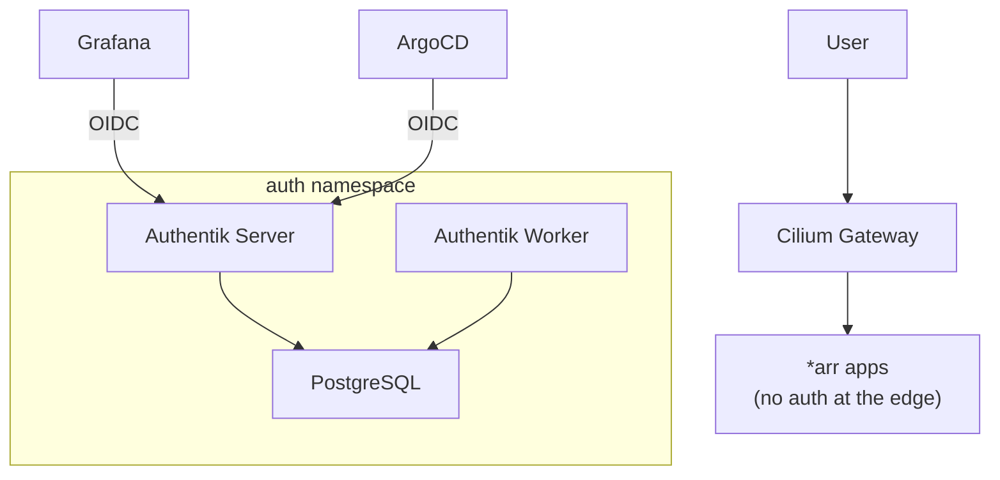

# Authentication & SSO

The homelab uses Authentik as the centralized identity provider. Only applications with native OIDC support currently authenticate against it.

## Authentication Flows

```mermaid
flowchart TB
    subgraph authNS ["auth namespace"]
        AuthentikServer["Authentik Server"]
        AuthentikWorker["Authentik Worker"]
        PostgreSQL["PostgreSQL"]
        AuthentikServer --> PostgreSQL
        AuthentikWorker --> PostgreSQL
    end

    User["User"] --> Gateway["Cilium Gateway"]
    Gateway --> UnprotectedApps["*arr apps<br/>(no auth at the edge)"]

    Grafana["Grafana"] -->|"OIDC"| AuthentikServer
    ArgoCD["ArgoCD"] -->|"OIDC"| AuthentikServer
```

Authentik runs its server and worker against a bundled PostgreSQL instance. The chart no longer deploys Redis -- the task queue moved to PostgreSQL -- so the `redis:` block still present in `values.yml` is inert.

### Forward Auth -- Not Currently Implemented

!!! danger "The *arr apps are not behind SSO"
    Forward auth was previously implemented with nginx-ingress `auth_request` annotations pointing at Authentik's embedded outpost. `ingress-nginx` was removed when every app migrated to Gateway API HTTPRoutes, and no equivalent was put in its place.

    **Sonarr, Radarr, Prowlarr, Bazarr, Tdarr, qBittorrent, and Homepage are reachable on the LAN with no authentication at the edge.** Each app's own login (where it has one) is the only control.

    Tracked as [K21](../roadmap/assessment.md) in the assessment. Re-implementing it requires an ext_authz path through Cilium's Envoy -- HTTPRoutes have no annotation-based equivalent to the nginx auth subrequest.

### Native OIDC

Apps with built-in OAuth2/OIDC support authenticate directly with Authentik. Each gets its own OAuth2 provider and application in Authentik, with a dedicated client ID and secret.

- **Grafana** -- `auth.generic_oauth` with role mapping (`admin` group -> Admin role)
- **ArgoCD** -- native OIDC via `oidc.config` in `argocd-cm` with RBAC group mapping
- **Seerr** -- OIDC not yet supported ([seerr-team/seerr#2715](https://github.com/seerr-team/seerr/pull/2715)); authenticates via Jellyfin

Server-to-server URLs (token, userinfo) use the internal service URL. Browser-facing URLs (authorize) use the external hostname.

### Unprotected Services

| Service | Reason |
|---------|--------|
| *arr apps, qBittorrent, Tdarr, Homepage | No edge auth since the Gateway API migration -- see the warning above |
| Jellyfin | Has its own user auth; media clients (Roku, Apple TV, mobile) can't do browser-based SSO |
| Prometheus | Internal monitoring; edge auth would break Grafana datasource scraping |
| Alertmanager | Same as Prometheus |
| Authentik | Circular dependency |

## Group-Based Access Control

| Group | Grafana Role | ArgoCD Role |
|-------|-------------|-------------|
| `authentik Admins` | Admin | `role:admin` |
| (default) | Viewer | Read-only |

## Resilience

Because no app depends on Authentik at the edge, an Authentik outage does not make any service inaccessible. Grafana and ArgoCD fall back to their own login pages. See the [emergency bypass runbook](../runbooks/authentik-emergency-bypass.md) for recovery procedures.

The `auth` namespace is included in Velero's daily stateful backup and the weekly full-cluster backup.
