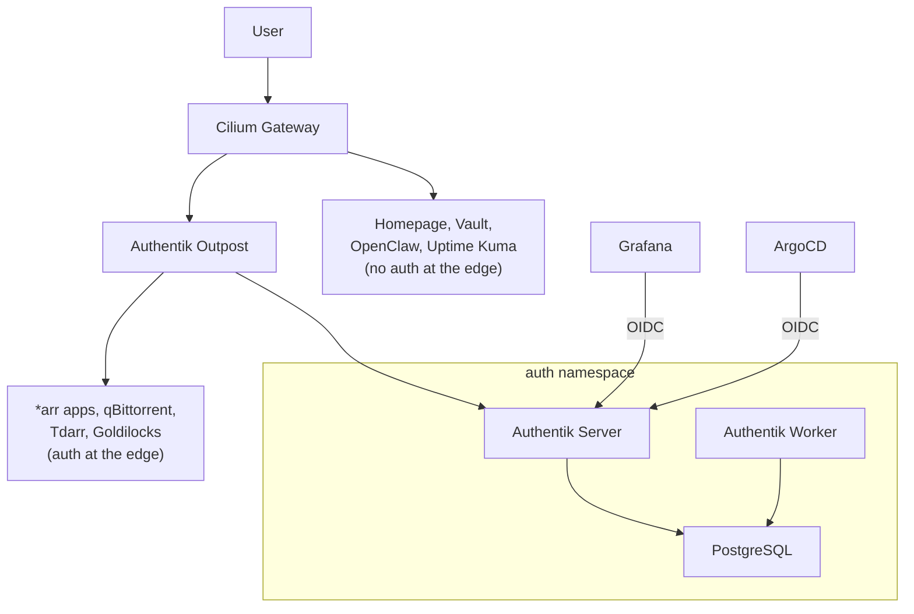

# Authentication & SSO

The homelab uses Authentik as the centralized identity provider. Applications authenticate either through native OIDC or by routing their traffic through Authentik's embedded outpost.

## Authentication Flows

```mermaid
flowchart TB
    subgraph authNS ["auth namespace"]
        AuthentikServer["Authentik Server"]
        AuthentikWorker["Authentik Worker"]
        PostgreSQL["PostgreSQL"]
        AuthentikServer --> PostgreSQL
        AuthentikWorker --> PostgreSQL
    end

    User["User"] --> Gateway["Cilium Gateway"]
    Gateway --> Outpost["Authentik Outpost"]
    Outpost --> ProtectedApps["*arr apps, qBittorrent,<br/>Tdarr, Goldilocks<br/>(auth at the edge)"]
    Outpost --> AuthentikServer
    Gateway --> UnprotectedApps["Homepage, Vault,<br/>OpenClaw, Uptime Kuma<br/>(no auth at the edge)"]

    Grafana["Grafana"] -->|"OIDC"| AuthentikServer
    ArgoCD["ArgoCD"] -->|"OIDC"| AuthentikServer
```

Authentik runs its server and worker against a bundled PostgreSQL instance. No Redis is deployed -- the task queue lives in PostgreSQL. The `authentik-external-secret.yml` still pulls a `redis-password` from Vault, which nothing consumes.

### Proxied Auth

Tdarr, Goldilocks, Sonarr, Radarr, Prowlarr, Bazarr and qBittorrent route through the embedded outpost, which authenticates the browser before proxying to the app. The outpost dispatches on the `Host` header, so one instance serves every protected app. Each app declares a proxy-mode provider in `infrastructure/authentik/blueprints-configmap.yml`.

Because the outpost originates the proxied request, it needs its own network path to each backend -- ingress on the app's namespace and egress from `auth`. Without both, the browser gets the login redirect and then hangs. See the [runbook](../runbooks/adding-app-to-sso.md).

The *arr apps and qBittorrent exempt `/api`, `/feed` and `/ping` from the proxy via `skip_path_regex`, because mobile and scripted clients cannot complete a browser login. Those paths are still guarded by each app's API key, and a request to them returns the app's own `401` rather than a login redirect.

!!! warning "Still open on the LAN"
    **Reachable with no edge auth: Homepage, Vault, OpenClaw and Uptime Kuma.** Vault is deliberate -- Authentik reads its own credentials from Vault through External Secrets, so protecting Vault with Authentik would deadlock an unseal.

### Native OIDC

Apps with built-in OAuth2/OIDC support authenticate directly with Authentik. Each gets its own OAuth2 provider and application in Authentik, with a dedicated client ID and secret.

- **Grafana** -- `auth.generic_oauth` with role mapping (`admin` group -> Admin role)
- **ArgoCD** -- native OIDC via `oidc.config` in `argocd-cm` with RBAC group mapping
- **Seerr** -- OIDC not yet supported ([seerr-team/seerr#2715](https://github.com/seerr-team/seerr/pull/2715)); authenticates via Jellyfin

Server-to-server URLs (token, userinfo) use the internal service URL. Browser-facing URLs (authorize) use the external hostname.

### Unprotected Services

| Service | Reason |
|---------|--------|
| Homepage | No edge auth; a dashboard of links, no data of its own |
| Vault | Cannot use Authentik -- Authentik's own secrets come from Vault, so this would be circular. Token auth is the control |
| OpenClaw | No edge auth; its own webhook routes are the only control |
| Uptime Kuma | No edge auth; has its own login |
| Jellyfin | Has its own user auth; media clients (Roku, Apple TV, mobile) can't do browser-based SSO |
| Prometheus | Internal monitoring; edge auth would break Grafana datasource scraping |
| Alertmanager | Same as Prometheus |
| Authentik | Circular dependency |

## Group-Based Access Control

| Group | Grafana Role | ArgoCD Role |
|-------|-------------|-------------|
| `authentik Admins` | Admin | `role:admin` |
| (default) | Viewer | Read-only |

## Resilience

Because no app depends on Authentik at the edge, an Authentik outage does not make any service inaccessible. Grafana and ArgoCD fall back to their own login pages. See the [emergency bypass runbook](../runbooks/authentik-emergency-bypass.md) for recovery procedures.

The `auth` namespace is included in Velero's daily stateful backup and the weekly full-cluster backup.
