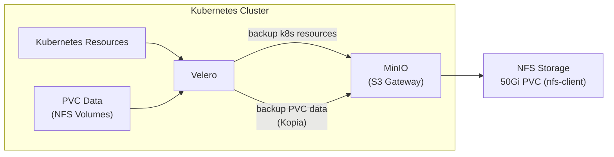
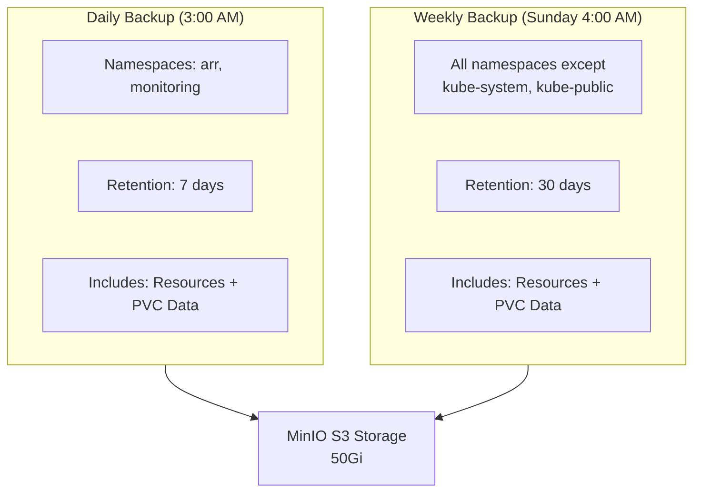
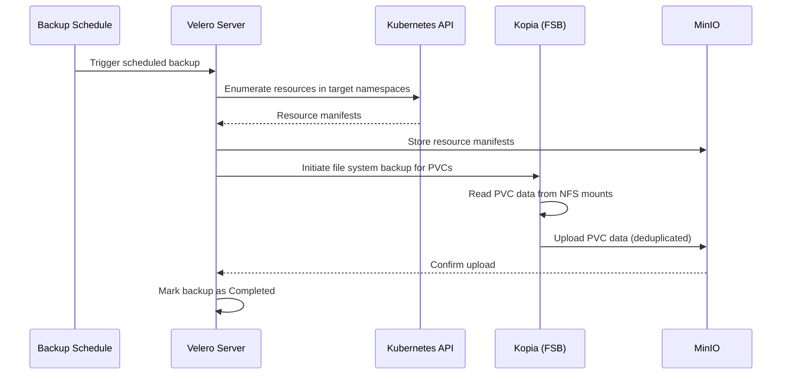

# Backups

This document covers the backup architecture using Velero and MinIO, including backup schedules, retention policies, PVC data protection, and restore procedures.

## Backup Architecture

Velero orchestrates cluster backups, storing Kubernetes resource manifests and PVC data in MinIO, an S3-compatible object store running within the cluster.



### Components

| Component | Namespace | Purpose |
|-----------|-----------|---------|
| Velero | `backups` | Backup orchestration, scheduling, and restore |
| MinIO | `backups` | S3-compatible object storage backend |
| Velero AWS Plugin | `backups` | S3 API compatibility layer for MinIO |
| Kopia (File System Backup) | `backups` | PVC data backup via file system copy |

## MinIO Configuration

MinIO runs in **standalone mode** in the `backups` namespace, providing an S3-compatible API that Velero uses as its backup storage location.

| Setting | Value |
|---------|-------|
| Namespace | `backups` |
| Mode | Standalone |
| Storage | 50Gi PVC (`nfs-client`) |
| Credentials | Sealed Secret (`minio-credentials`) |
| Sync Wave | -2 |

## Velero Configuration

Velero uses the AWS plugin to communicate with MinIO over the S3 API. File system backup (powered by Kopia) handles PVC data.

| Setting | Value |
|---------|-------|
| Namespace | `backups` |
| Plugin | `velero-plugin-for-aws` |
| Backup Storage | MinIO (S3-compatible) |
| Volume Backup Method | File System Backup (Kopia) |
| Credentials | Sealed Secret (`velero-cloud-credentials`) |
| Sync Wave | -1 |

!!! info "Why Kopia?"
    Velero's file system backup (formerly Restic, now Kopia) copies PVC data at the file level. This works with any storage backend, including NFS, without requiring volume snapshot support from the storage provider.

## Backup Schedules

Two complementary backup schedules provide both granular recovery for stateful applications and broad disaster recovery for the entire cluster.



### Schedule Table

| Schedule | Frequency | Time | Namespaces | Retention | Includes PVC Data |
|----------|-----------|------|-----------|-----------|-------------------|
| Daily Stateful | Every day | 3:00 AM | `arr`, `monitoring` | 7 days | Yes |
| Weekly Full | Every Sunday | 4:00 AM | All (except `kube-system`, `kube-public`) | 30 days | Yes |

The daily backup targets the namespaces with the most frequently changing state -- media application databases and monitoring data. The weekly backup captures everything for full disaster recovery.

## Backup Flow



## Manual Backup Commands

### Create an On-Demand Backup

```bash
# Backup specific namespaces
velero backup create manual-arr-backup \
  --include-namespaces arr \
  --default-volumes-to-fs-backup \
  --ttl 168h

# Backup everything (except kube-system, kube-public)
velero backup create manual-full-backup \
  --exclude-namespaces kube-system,kube-public \
  --default-volumes-to-fs-backup \
  --ttl 720h
```

### Check Backup Status

```bash
# List all backups
velero backup get

# Describe a specific backup
velero backup describe manual-arr-backup --details

# View backup logs
velero backup logs manual-arr-backup
```

### Restore from Backup

```bash
# Restore an entire backup
velero restore create --from-backup manual-arr-backup

# Restore specific namespaces from a backup
velero restore create --from-backup manual-full-backup \
  --include-namespaces arr

# Restore specific resources
velero restore create --from-backup manual-full-backup \
  --include-namespaces monitoring \
  --include-resources persistentvolumeclaims,persistentvolumes
```

### Check Restore Status

```bash
# List restores
velero restore get

# Describe a specific restore
velero restore describe <restore-name> --details

# View restore logs
velero restore logs <restore-name>
```

!!! warning "Restore Considerations"
    When restoring, Velero will not overwrite existing resources by default. If resources already exist in the cluster, delete them first or use the `--existing-resource-policy=update` flag. For PVC data, the file system restore writes data back to the PVC volumes.

## Disaster Recovery Procedure

In the event of a full cluster rebuild:

1. **Rebuild the cluster** using Terraform and Ansible
2. **Deploy ArgoCD** and the root application
3. **Wait for MinIO** to come up (sync wave -2) with its NFS-backed data intact
4. **Wait for Velero** to come up (sync wave -1) and connect to MinIO
5. **Verify backups** are visible: `velero backup get`
6. **Restore** the required namespaces from the most recent backup
7. **Verify** application health and data integrity

!!! tip "NFS Data Survives Cluster Rebuilds"
    Because MinIO stores backup data on an NFS PVC (backed by the Unifi NAS), backup data persists even if the entire Kubernetes cluster is destroyed and rebuilt. The NFS provisioner uses the `Retain` reclaim policy, preserving data on the NAS.
