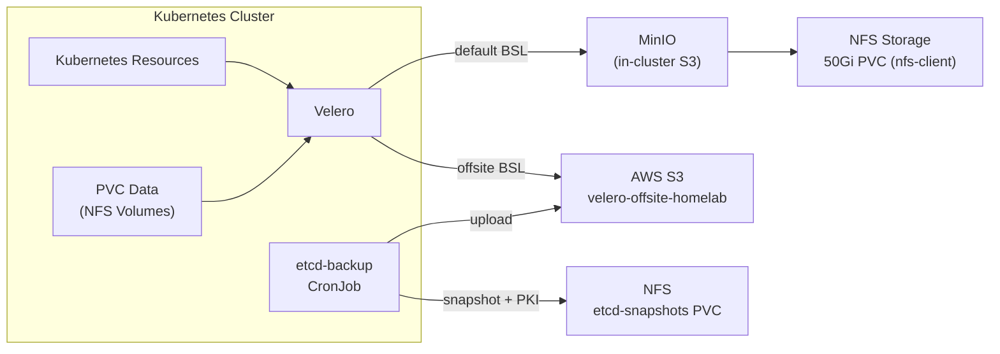
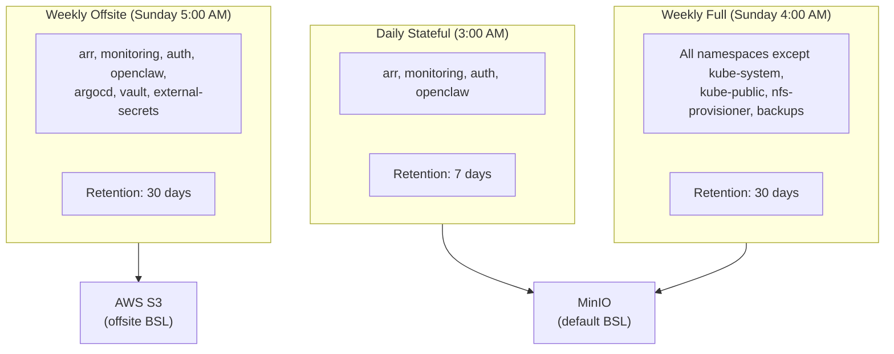
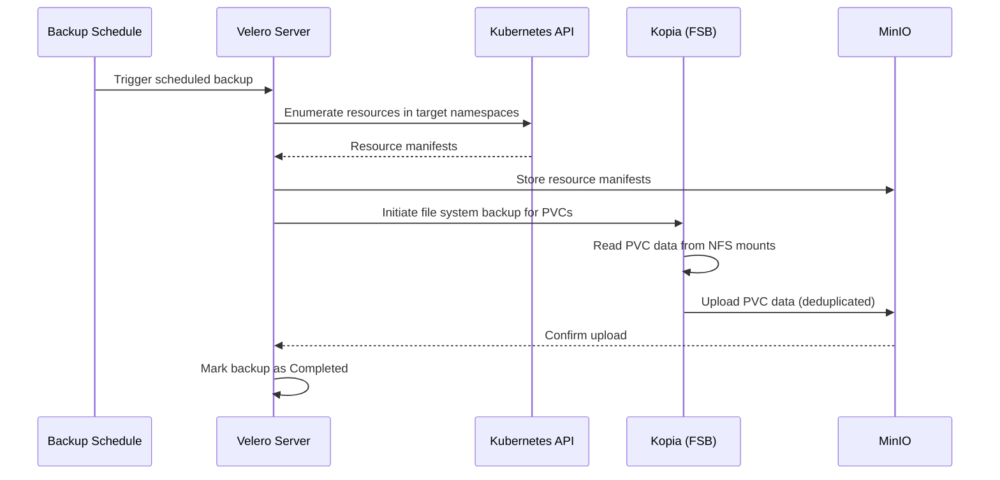

# Backups

This document covers the backup architecture: Velero to MinIO on-site, Velero to AWS S3 offsite, and a separate etcd snapshot CronJob.

## Backup Architecture

Velero orchestrates cluster backups against two storage locations -- MinIO inside the cluster for fast local recovery, and an AWS S3 bucket for offsite copies that survive losing the NAS.


```mermaid
flowchart LR
    subgraph cluster["Kubernetes Cluster"]
        resources["Kubernetes Resources"] --> velero["Velero"]
        pvcData["PVC Data\n(NFS Volumes)"] --> velero
        etcdCron["etcd-backup\nCronJob"]
    end

    velero -->|"default BSL"| minio["MinIO\n(in-cluster S3)"]
    velero -->|"offsite BSL"| s3["AWS S3\nvelero-offsite-homelab"]
    minio --> nfsStorage["NFS Storage\n50Gi PVC (nfs-client)"]
    etcdCron -->|"snapshot + PKI"| nfsSnap["NFS\netcd-snapshots PVC"]
    etcdCron -->|"upload"| s3
```

### Components

| Component | Namespace | Purpose |
|-----------|-----------|---------|
| Velero | `backups` | Backup orchestration, scheduling, and restore |
| MinIO | `backups` | S3-compatible object storage backend (on-site) |
| AWS S3 | -- | Offsite backup target (`velero-offsite-homelab`, us-east-1) |
| Velero AWS Plugin | `backups` | S3 API compatibility layer for both locations |
| Kopia (File System Backup) | `backups` | PVC data backup via file system copy |
| etcd-backup CronJob | `backups` | Nightly etcd snapshot + PKI tarball, to NFS and S3 |

### Backup Storage Locations

| Name | Provider | Bucket | Prefix | Region |
|------|----------|--------|--------|--------|
| `default` | aws (MinIO) | `velero` | -- | `minio` (path-style) |
| `offsite` | aws (S3) | `velero-offsite-homelab` | `velero` | `us-east-1` |

!!! warning "The offsite prefix is load-bearing"
    Velero rejects a bucket containing unknown top-level directories. The etcd CronJob writes `etcd-snapshots/` to the root of the same bucket, so the offsite location **must** keep its `velero` prefix. Without it the location goes `Unavailable` and every offsite backup fails validation -- silently, for as long as nobody looks.

## MinIO Configuration

MinIO runs in **standalone mode** in the `backups` namespace, providing an S3-compatible API that Velero uses as its backup storage location.

| Setting | Value |
|---------|-------|
| Namespace | `backups` |
| Mode | Standalone |
| Storage | 50Gi PVC (`nfs-client`) |
| Credentials | ExternalSecret (`minio-credentials`, synced from Vault) |

## Velero Configuration

Velero uses the AWS plugin to communicate with MinIO over the S3 API. File system backup (powered by Kopia) handles PVC data.

| Setting | Value |
|---------|-------|
| Namespace | `backups` |
| Plugin | `velero-plugin-for-aws` |
| Backup Storage | MinIO (`default`) and AWS S3 (`offsite`) |
| Volume Backup Method | File System Backup (Kopia) |
| Node Agent | DaemonSet, tolerates the control-plane taint so it runs on all three nodes |
| Credentials | ExternalSecrets `velero-cloud-credentials` and `velero-offsite-credentials` |

!!! info "Why Kopia?"
    Velero's file system backup (formerly Restic, now Kopia) copies PVC data at the file level. This works with supported mounted volumes, including NFS, without requiring volume snapshot support from the storage provider.

!!! danger "Kopia cannot read local-path volumes"
    File-system backup skips `hostPath` volumes, which is what the `local-path` provisioner creates. Every *arr config PVC, the Prometheus TSDB, and Uptime Kuma's database are captured as objects holding **no data**, and Velero records this as a warning rather than an error -- so the backup reports `Completed`.

    The application databases are covered instead by the `arr-config-backup` and `uptime-kuma-backup` CronJobs, which dump SQLite through its online backup API onto `nfs-client` volumes that Velero does read. Prometheus TSDB history has no corresponding dump and is not protected. SQLite dumps omit non-database application files; Vault's live file-backend copy still needs a consistent recovery method. Authentik now has a native PostgreSQL dump and a verified isolated database restore. See [Storage](storage.md#local-path-provisioner).

    Kopia also only reads volumes attached to a **running** pod. Each backup volume is kept mounted by a holder Deployment; without it the mechanism silently captures nothing.

All schedule times below are UTC. Offsite excludes `backups` to avoid copying MinIO's local archives; etcd snapshots already have a separate S3 upload. OpenClaw state is included in daily and offsite schedules.

## Backup Schedules

Three schedules cover granular daily recovery, broad on-site disaster recovery, and an offsite copy.


```mermaid
flowchart TD
    subgraph daily["Daily Stateful (3:00 AM)"]
        dailyTarget["arr, monitoring, auth, openclaw"]
        dailyRetention["Retention: 7 days"]
    end

    subgraph weekly["Weekly Full (Sunday 4:00 AM)"]
        weeklyTarget["All namespaces except kube-system,\nkube-public, nfs-provisioner, backups"]
        weeklyRetention["Retention: 30 days"]
    end

    subgraph offsite["Weekly Offsite (Sunday 5:00 AM)"]
        offsiteTarget["arr, monitoring, auth, openclaw,\nargocd, vault, external-secrets"]
        offsiteRetention["Retention: 30 days"]
    end

    daily --> minio["MinIO\n(default BSL)"]
    weekly --> minio
    offsite --> s3["AWS S3\n(offsite BSL)"]
```

### Schedule Table

| Schedule | Frequency | Time | Namespaces | Retention | Location |
|----------|-----------|------|-----------|-----------|----------|
| `daily-stateful` | Every day | 3:00 AM | `arr`, `monitoring`, `auth`, `openclaw` | 7 days | `default` |
| `weekly-full-cluster` | Every Sunday | 4:00 AM | All except `kube-system`, `kube-public`, `nfs-provisioner`, `backups` | 30 days | `default` |
| `weekly-offsite` | Every Sunday | 5:00 AM | `arr`, `monitoring`, `auth`, `openclaw`, `argocd`, `vault`, `external-secrets` | 30 days | `offsite` |

The daily backup targets the namespaces with the most frequently changing state. The weekly full backup captures everything on-site; `backups` is excluded from it because backing MinIO up into itself is circular. The offsite backup narrows to what is needed to rebuild from nothing.

!!! note "Schedule label naming"
    Velero prefixes generated backups with the release name, so alert selectors must match `schedule="velero-weekly-offsite"`, not `schedule="weekly-offsite"`.

## etcd Snapshots

Velero backs up Kubernetes API resources, not etcd itself. A separate CronJob in the `backups` namespace covers quorum loss and etcd corruption.

| Setting | Value |
|---------|-------|
| Schedule | `0 2 * * *` (2:00 AM daily) |
| Snapshot image | `registry.k8s.io/etcd` (matched to the cluster's etcd version) |
| Local target | `etcd-snapshots` PVC (`nfs-client`, 1Gi) |
| Offsite target | `s3://velero-offsite-homelab/etcd-snapshots/` |
| Credentials | ExternalSecret (`etcd-backup-credentials`, from `infrastructure/etcd-backup`) |
| Alerting | `EtcdBackupStale` PrometheusRule |

Each run writes both a `snapshot-<timestamp>.db` and a `pki-<timestamp>.tar.gz` of `/etc/kubernetes/pki`, since a snapshot is useless for rebuilding a control plane without the matching CA material. The job is pinned to the control-plane node, so it cannot run if that node is unschedulable.

See [Disaster Recovery](../runbooks/disaster-recovery.md#etcd-restore-control-plane-corruption) for the restore procedure.

## Backup Flow


```mermaid
sequenceDiagram
    participant schedule as Backup Schedule
    participant velero as Velero Server
    participant k8sApi as Kubernetes API
    participant kopia as Kopia (FSB)
    participant minio as MinIO

    schedule->>velero: Trigger scheduled backup
    velero->>k8sApi: Enumerate resources in target namespaces
    k8sApi-->>velero: Resource manifests
    velero->>minio: Store resource manifests
    velero->>kopia: Initiate file system backup for PVCs
    kopia->>kopia: Read PVC data from NFS mounts
    kopia->>minio: Upload PVC data (deduplicated)
    minio-->>velero: Confirm upload
    velero->>velero: Mark backup as Completed
```

## Manual Backup Commands

### Create an On-Demand Backup

```bash
# Backup specific namespaces
velero --namespace backups backup create manual-arr-backup \
  --include-namespaces arr \
  --default-volumes-to-fs-backup \
  --ttl 168h

# Backup everything (except kube-system, kube-public)
velero --namespace backups backup create manual-full-backup \
  --exclude-namespaces kube-system,kube-public,nfs-provisioner,backups \
  --default-volumes-to-fs-backup \
  --ttl 720h
```

### Check Backup Status

```bash
# List all backups
velero --namespace backups backup get

# Describe a specific backup
velero --namespace backups backup describe manual-arr-backup --details

# View backup logs
velero --namespace backups backup logs manual-arr-backup
```

### Restore from Backup

```bash
# Restore an entire backup
velero --namespace backups restore create --from-backup manual-arr-backup

# Restore specific namespaces from a backup
velero --namespace backups restore create --from-backup manual-full-backup \
  --include-namespaces arr

# Restore specific resources
velero --namespace backups restore create --from-backup manual-full-backup \
  --include-namespaces monitoring \
  --include-resources persistentvolumeclaims,persistentvolumes
```

### Check Restore Status

```bash
# List restores
velero --namespace backups restore get

# Describe a specific restore
velero --namespace backups restore describe <restore-name> --details

# View restore logs
velero --namespace backups restore logs <restore-name>
```

!!! warning "Restore considerations"
    Restore into empty, isolated targets and review PV mappings first. Updating an existing Kubernetes object is not equivalent to restoring its database files. Follow [Backup & Restore](../runbooks/backup-and-restore.md) for local-path dumps and WAL handling.

## Disaster Recovery Procedure

Follow the [staged disaster recovery runbook](../runbooks/disaster-recovery.md#complete-cluster-rebuild). It resolves the Vault/ESO/backup-credential bootstrap cycle and separates restoring the old control plane from rebuilding a new cluster. `Retain` preserves NFS directories but does not bind new PVCs to them automatically.

A green backup status is not a restore test. Record an isolated application restore, database integrity, file freshness, and external credential availability before marking recovery work complete.

## Recovery Coverage

The active PVC inventory below separates a captured volume from a demonstrated application recovery. Git recreates deployments and declared configuration; Vault/ESO supply referenced credentials. Neither replaces runtime data omitted from the backup. The weekly offsite schedule includes `arr`, `auth`, `monitoring`, `openclaw`, `argocd`, `vault` and `external-secrets`. MinIO and the NFS provisioner's root export are deliberately outside that schedule.

| Namespace / PVC | Data and recovery mechanism | Remaining limitation |
|-----------------|-----------------------------|----------------------|
| `arr/arr-bazarr-config` | Daily SQLite dump at `bazarr/db/bazarr.db` in the holder volume | Non-database files and application restore unverified |
| `arr/arr-jellyfin-config` | Daily SQLite dump at `jellyfin/data/data/jellyfin.db` | Artwork/plugins and full application restore unverified |
| `arr/arr-prowlarr-config` | Daily `prowlarr/prowlarr.db` dump; declared settings in Git | Real tracker credentials and restored database behavior unverified |
| `arr/arr-radarr-config` | Daily `radarr/radarr.db` dump | Application restore and profile recreation unverified |
| `arr/arr-seerr-config` | Daily `seerr/db/db.sqlite3` dump | Requires media-server login and valid recreated profile IDs; `.backup-preop` is an extra rollback copy, not the active database |
| `arr/arr-sonarr-config` | Daily `sonarr/sonarr.db` dump | Offsite database, login, records and bounded controller recovery verified; media/integration recovery remains separate |
| `arr/arr-tdarr-config` | Daily copy of the latest native archive, with age/CRC checks | Archive and primary SQLite integrity verified; application/flow restore still required |
| `arr/arr-config-backups` | NFS staging volume mounted by `arr-config-backup-holder`; daily MinIO and weekly S3 | A successful copy job alone does not demonstrate upload or application recovery |
| `arr/arr-data` | Shared media/downloads on NFS; deliberately excluded from Velero volume backups | No independent media copy demonstrated; NAS redundancy does not replace a backup |
| `arr/arr-recyclarr` | NFS state/cache mounted by its holder, captured by Velero; profiles in shared Git configuration | Sonarr profile recreation verified; Radarr recovery remains open |
| `arr/arr-vpn-downloads-gluetun-config` | Live NFS file backup; VPN settings/credentials also come from Git/Vault | Fresh VPN bootstrap not demonstrated |
| `arr/arr-vpn-downloads-qbit-config` | Live NFS file backup including qBittorrent configuration/resume state | Resume consistency and application recovery unverified |
| `auth/data-authentik-postgresql-0` | Native `pg_dump` to `authentik-backups`; raw volume is also captured | Raw live PostgreSQL files are not the database recovery method; preserve Authentik's secret key separately |
| `auth/authentik-backups` | Daily custom-format PostgreSQL archive, mounted by a holder and captured by Velero | S3 database, emergency login and OIDC code exchange verified; ordinary login/MFA, clients and proxy/worker recovery remain open |
| `backups/etcd-snapshots` | Daily etcd snapshot plus matching PKI, uploaded directly to `etcd-snapshots/` in S3 | Seven retained pairs; isolated control-plane restoration still required |
| `backups/minio` | Local Velero object store | Excluded from offsite to avoid recursive copying; recover applications from independent S3 copies |
| `monitoring/kube-prometheus-stack-grafana` | Live NFS volume backup; provisioned dashboards/datasources in Git | SQLite consistency and recovery of non-provisioned settings unverified |
| `monitoring/prometheus-kube-prometheus-stack-prometheus-db-prometheus-kube-prometheus-stack-prometheus-0` | Local-path TSDB, skipped by Velero | Historical metrics have no independent backup |
| `monitoring/storage-loki-0` | Live NFS volume backup | Log/index consistency and application restore unverified |
| `monitoring/uptime-kuma-data` | Daily SQLite online dump to `uptime-kuma-backups` | Application login/monitor restoration unverified |
| `monitoring/uptime-kuma-backups` | NFS dump staging volume mounted by its holder | Captured offsite; still requires application-level restoration |
| `nfs-provisioner/pvc-nfs-provisioner-nfs-subdir-external-provisioner` | Root export mount used by the provisioner | Not a separate copy of child PVC data; reconstruct provisioning from Git |
| `openclaw/openclaw` | NFS workspace/runtime state captured by daily and offsite Velero | Restore with integrations and remediation disabled until credentials and scope are verified |
| `vault/data-vault-0` | Live file-backend volume captured by weekly local/offsite Velero | Consistent quiesced backup and KMS-backed recovery remain unverified; KMS alone cannot reconstruct Vault data |

Pods without persistent data rely on Git and their external secret sources. Retained/released PV directories are not automatically rebound or validated by this inventory; preserve and identify them before attempting recovery. ConfigMaps and Secret objects may exist in a Velero backup, but that does not demonstrate that independent bootstrap credentials are available during site loss.

### Schedule Limits and Verified Contents

SQLite/native dumps and the Authentik logical dump run daily before the 03:00 UTC local backup. Most application offsite data is uploaded weekly at 05:00 UTC Sunday, so an offsite recovery point can be roughly seven days old plus the dump-to-upload interval. Vault's current raw copy is weekly; etcd snapshots are uploaded daily and retain seven pairs. These are implementation limits, not agreed acceptable data-loss or recovery-time targets. Set those targets before claiming the schedules meet them.

`recovery-verify-20260921` completed with all 42 PodVolumeBackups complete and no errors. Its 30 warnings comprised 20 completed-job volumes, nine unsupported local-path volumes and one unused ArgoCD volume. The local-path warnings correspond to the seven media config PVCs, Uptime Kuma and Prometheus; the first eight have separate dump/archive paths, while Prometheus history remains unprotected. Do not globally suppress these warnings: a new unsupported stateful volume would be a real coverage gap.

The downloaded S3 media holder contained the canonical dumps for Bazarr, Jellyfin, Prowlarr, Radarr, Seerr and Sonarr; each passed SQLite integrity checks. Tdarr's 501-entry native archive passed ZIP CRC validation, and its primary `DB2/SQL/database.db` passed SQLite integrity checking. These checks establish readable contents, not application recovery. The later `authentik-logical-20260921` backup separately captured the newly added logical PostgreSQL dump; its [restore evidence](../runbooks/backup-and-restore.md#authentik-postgresql-recovery) records the database-level checks.
