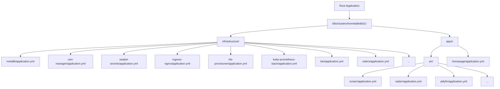
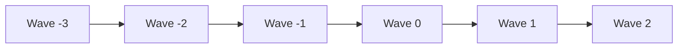
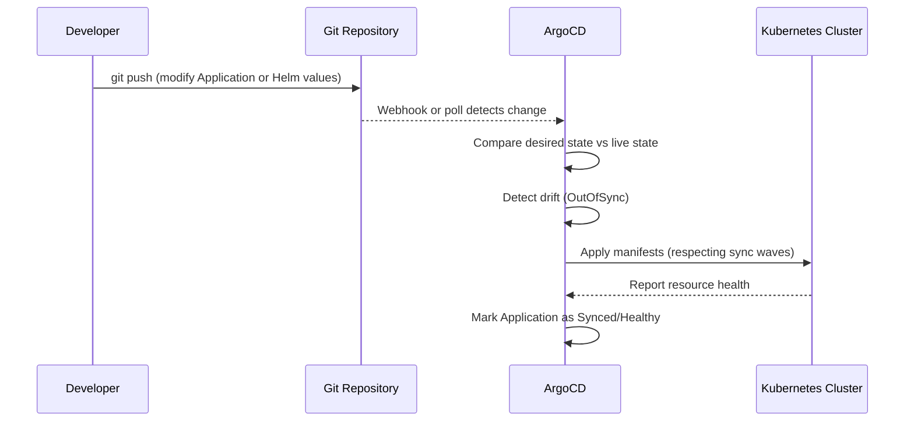

# GitOps with ArgoCD

ArgoCD manages the entire cluster lifecycle declaratively. Every infrastructure component and application is defined as an ArgoCD `Application` custom resource in Git. Changes flow from a `git push` to live cluster state without manual intervention.

## App-of-Apps Pattern

The homelab uses the **app-of-apps** pattern with **directory recursion**. A single root Application watches a directory tree and automatically discovers child Application manifests.

### Root Application

The root application is defined at `k8s/bootstrap/root-app.yml`. It uses the `directory.recurse` source option to scan `k8s/clusters/homelabk8s01` for any `*.yml` file matching an ArgoCD Application resource.

Key configuration:

- **Source path:** `k8s/clusters/homelabk8s01`
- **Directory recurse:** Enabled -- scans all subdirectories
- **Include pattern:** `*.yml`
- **Automated sync:** Enabled with `prune` and `selfHeal`

When ArgoCD processes the root application, it discovers every `application.yml` file in the directory tree and creates the corresponding child Applications in the cluster.

### Child Applications

Each child Application manifest defines:

- The Helm chart repository and version (or Git source) for the component
- Helm values inline or from a values file
- The target namespace
- Sync policy (automated with prune and self-heal)
- A **sync wave annotation** controlling deployment order

## Sync Wave Ordering

Sync waves ensure dependencies are deployed before the components that rely on them. ArgoCD processes waves in ascending numerical order, waiting for each wave to become healthy before proceeding.

### Sync Wave Table

| Wave | Components | Rationale |
|------|-----------|-----------|
| -3 | MetalLB, cert-manager, Sealed Secrets | Core infrastructure that everything depends on: IP allocation, TLS, and secret decryption |
| -2 | MetalLB Config, Metrics Server, NFS Provisioner, MinIO, Intel GPU Operator | Configuration and storage primitives needed by higher-level services |
| -1 | ingress-nginx, kube-prometheus-stack, Loki, Velero, Intel GPU Plugin, Reloader, Descheduler | Ingress routing, monitoring stack, backup system, GPU device plugin, config reload automation, and pod rebalancing |
| 0 | Authentik, Alloy | SSO provider and log collector; both depend on wave -1 services (ingress, monitoring) being available |
| 1 | All arr apps (Jellyfin, Sonarr, Radarr, Prowlarr, Bazarr, Jellyseerr, qBittorrent/SABnzbd/Gluetun, Recyclarr, Tdarr, Exportarr) | Application workloads requiring ingress, storage, monitoring, and GPU resources |
| 2 | Homepage, Uptime Kuma | Dashboard and status page that aggregate links to all other services; deployed last |

## Git Push to Cluster State

The following diagram illustrates the complete lifecycle of a change:

## Automated Sync Policy

All Applications are configured with automated sync:

- **Prune:** Resources removed from Git are deleted from the cluster
- **Self-Heal:** Manual changes made directly to the cluster are reverted to match Git
- **Retry:** Failed syncs are retried automatically

!!! warning "Manual Overrides"
    With self-heal enabled, any manual `kubectl` changes will be reverted on the next sync cycle. Always commit changes to Git rather than applying them directly.

## Adding a New Application

To add a new application to the cluster:

1. Create a directory under `k8s/clusters/homelabk8s01/apps/` (or `infrastructure/` for infra components)
2. Add an `application.yml` defining the ArgoCD Application resource
3. Set the appropriate sync wave annotation
4. Include any sealed secrets or additional manifests in the same directory
5. Commit and push -- ArgoCD discovers and deploys the new Application automatically

!!! tip "No Registration Required"
    Because the root app uses directory recursion, new Applications are discovered automatically. There is no need to modify the root app or any parent manifest.
