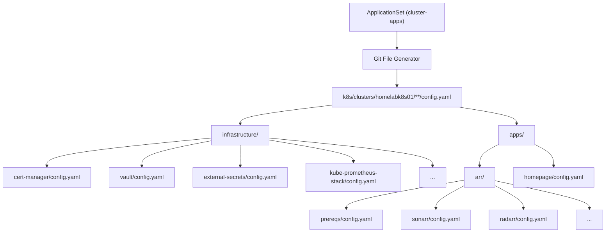
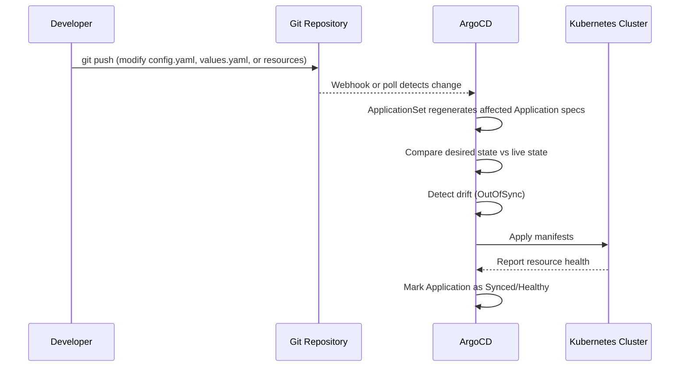

# GitOps with ArgoCD

ArgoCD manages the entire cluster lifecycle declaratively. Every infrastructure component and application is defined as an ArgoCD `Application` custom resource in Git. Changes flow from a `git push` to live cluster state without manual intervention.

## ApplicationSet Pattern

The homelab uses an **ApplicationSet** with a **Git File Generator** to discover `config.yaml` files and generate independent Applications per component. Each app syncs in isolation -- no cross-app blocking.

### ApplicationSet Definition

The ApplicationSet is defined at `k8s/bootstrap/applicationsets/cluster-apps.yml`. It uses a Git File Generator to discover all `config.yaml` files under `k8s/clusters/homelabk8s01/` and generates an Application for each one.

Key configuration:

- **Generator:** Git File Generator matching `**/config.yaml`
- **Go templates:** Enabled with `missingkey=error`
- **`templatePatch`:** Handles conditional rendering of `sources` (Helm multi-source) vs `source` (git single-source)
- **Automated sync:** Enabled with `prune`, `selfHeal`, and retry backoff

### Per-App Directory Structure

Each app directory contains up to three files consumed by the ApplicationSet:

| File | Purpose | Required |
|------|---------|----------|
| `config.yaml` | App metadata: name, namespace, chart info, sync options | Always |
| `values.yaml` | Helm chart values | Helm apps only |
| `kustomization.yaml` | Lists supporting resources (PDBs, ExternalSecrets, HTTPRoutes) | Only if supporting resources exist |

**Helm apps** produce multi-source Applications:

1. **Chart source**: Helm repository with `values.yaml` from git
2. **Values ref**: Git repo reference for the values file
3. **Kustomize source** (optional): Supporting resources from the same directory

**Git-directory apps** (network-policies, gateway, kyverno-policies) produce single-source Applications pointing to a git path.

## Independent Syncs

Each Application syncs independently. Unlike the previous app-of-apps pattern where a single root Application synced all children as one operation, ApplicationSet-generated apps have no cross-app sync dependencies. A broken app does not block fixes to other apps.

Ordering between apps (e.g., the `arr` namespace must exist before arr apps deploy) is handled by health checks -- an app targeting namespace `arr` will wait for the namespace to exist, which is created by the `arr-prereqs` Application.

## Namespace Strategy

Two patterns based on whether a namespace is shared:

- **Single-app namespaces** (auth, vault, monitoring, cert-manager, etc.): `CreateNamespace=true` on the Application. No separate namespace manifest.
- **Shared namespace** (arr): A dedicated `arr/prereqs` Application owns the namespace, shared PV, and shared ConfigMap.

## Git Push to Cluster State

The following diagram illustrates the complete lifecycle of a change:

## Automated Sync Policy

All Applications are configured with automated sync:

- **Prune:** Resources removed from Git are deleted from the cluster
- **Self-Heal:** Manual changes made directly to the cluster are reverted to match Git
- **Retry:** Failed syncs are retried with exponential backoff (10s to 3m, up to 10 retries)

!!! warning "Manual Overrides"
    With self-heal enabled, any manual `kubectl` changes will be reverted on the next sync cycle. Always commit changes to Git rather than applying them directly.

## Adding a New Application

To add a new application to the cluster:

1. Create a directory under `k8s/clusters/homelabk8s01/apps/` (or `infrastructure/` for infra components)
2. Add a `config.yaml` with app metadata (name, namespace, chart info, sync options)
3. Add a `values.yaml` with Helm chart values
4. If the app has supporting resources (PDBs, ExternalSecrets, HTTPRoutes), add them and create a `kustomization.yaml` listing them
5. Commit and push -- the ApplicationSet discovers and deploys the new Application automatically

!!! tip "No Registration Required"
    The ApplicationSet's Git File Generator automatically discovers new `config.yaml` files. There is no need to modify the ApplicationSet definition or any parent manifest.
