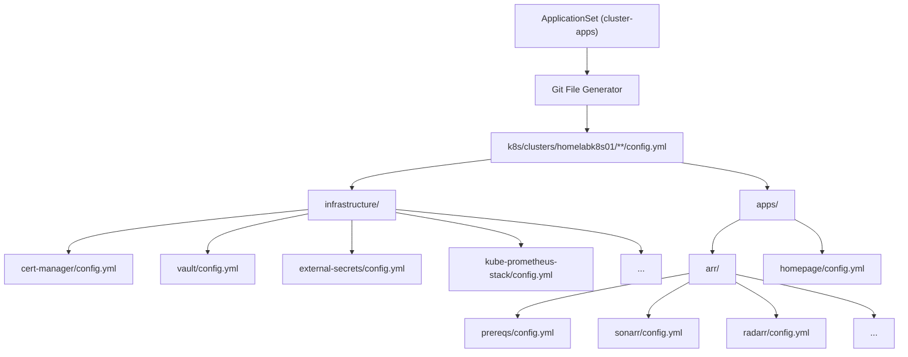
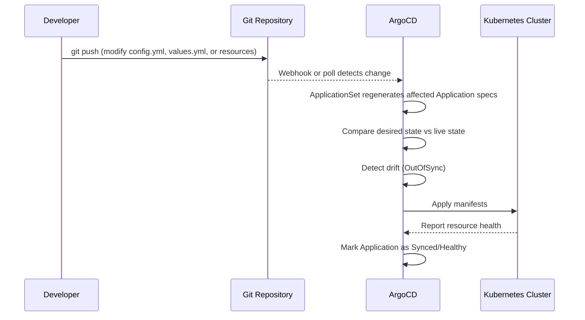

# GitOps with ArgoCD

ArgoCD reconciles discovered cluster infrastructure and applications declaratively. Terraform and Ansible own the VM and Kubernetes bootstrap, while ArgoCD itself and the root ApplicationSet are installed manually by `make k8s-bootstrap`. Every infrastructure component and application is defined as an ArgoCD `Application` custom resource in Git. Changes flow from a `git push` to live cluster state without manual intervention.

## ApplicationSet Pattern

The homelab uses an **ApplicationSet** with a **Git File Generator** to discover `config.yml` files and generate independent Applications per component. Each app syncs in isolation -- no cross-app blocking.

```mermaid
flowchart TD
    appSet["ApplicationSet (cluster-apps)"] --> generator["Git File Generator"]
    generator --> glob["k8s/clusters/homelabk8s01/**/config.yml"]

    glob --> infraConfigs["infrastructure/"]
    glob --> appConfigs["apps/"]

    infraConfigs --> certManager["cert-manager/config.yml"]
    infraConfigs --> vault["vault/config.yml"]
    infraConfigs --> externalSecrets["external-secrets/config.yml"]
    infraConfigs --> prometheusStack["kube-prometheus-stack/config.yml"]
    infraConfigs --> moreInfra["..."]

    appConfigs --> arrDir["arr/"]
    appConfigs --> homepage["homepage/config.yml"]

    arrDir --> prereqs["prereqs/config.yml"]
    arrDir --> sonarr["sonarr/config.yml"]
    arrDir --> radarr["radarr/config.yml"]
    arrDir --> moreArr["..."]
```

### ApplicationSet Definition

The ApplicationSet is defined at `k8s/bootstrap/applicationsets/cluster-apps.yml`. It uses a Git File Generator to discover all `config.yml` files under `k8s/clusters/homelabk8s01/` and generates an Application for each one.

Key configuration:

- **Generator:** Git File Generator matching `**/config.yml`
- **Go templates:** Enabled with `missingkey=error`
- **`templatePatch`:** Handles conditional rendering of `sources` (Helm multi-source) vs `source` (git single-source)
- **Automated sync:** Enabled with `prune`, `selfHeal`, and retry backoff

### Per-App Directory Structure

Each app directory contains up to three files consumed by the ApplicationSet:

| File | Purpose | Required |
|------|---------|----------|
| `config.yml` | App metadata: name, namespace, chart info, sync options | Always |
| `values.yml` | Helm chart values | Helm apps only |
| `kustomization.yml` | Lists supporting resources (PDBs, ExternalSecrets, HTTPRoutes) | Only if supporting resources exist |

**Helm apps** produce multi-source Applications:

1. **Chart source**: Helm repository with `values.yml` from git
2. **Values ref**: Git repo reference for the values file
3. **Kustomize source** (optional): Supporting resources from the same directory

**Git-directory apps** (`sourceType: git` -- network-policies, gateway, gateway-api, kyverno-policies, etcd-backup, arr-prereqs, arr-media-config, arr-config-backup) produce single-source Applications pointing to a git path.

All directory sources use `sourceType: git`, including local-path-provisioner. ArgoCD detects `kustomization.yml` in the target directory and builds it.

!!! warning "The `.yml` extension is load-bearing"
    The generator glob is `k8s/clusters/homelabk8s01/**/config.yml`. A file named `config.yaml` is not discovered, no Application is generated, and nothing reports an error -- the component simply never deploys.

## Independent Syncs

Each Application syncs independently. ApplicationSet-generated apps have no cross-app sync dependencies. A broken app does not block fixes to other apps.

The cost of that independence is that **there is no ordering mechanism at all**. `argocd.argoproj.io/sync-wave` orders resources *within* one Application's sync; it does nothing between Applications, because the applicationset-controller creates them directly with no parent Application syncing them. Any wave annotation on a generated Application -- there is still one in `local-path-provisioner/config.yml` -- is inert.

Ordering emerges from failure and retry instead. An app targeting the `arr` namespace before `arr-prereqs` has created it fails, backs off, and succeeds on a later attempt. With `retry: limit 10` and backoff from 10s to 3m, dependencies can converge after transient failures. Convergence is not guaranteed: missing secret material, Vault initialization or dependencies that outlive the retry budget require intervention and a new sync.

## Namespace Strategy

Two patterns based on whether a namespace is shared:

- **Chart-created namespaces:** `CreateNamespace=true` ensures namespaces exist. Some Applications additionally own namespace manifests for labels or annotations; check their Kustomize resources. Monitoring is shared by several Applications.
- **Shared namespace** (arr): A dedicated `arr/prereqs` Application owns the namespace, shared PV, and shared ConfigMap.

Bootstrap resources are outside this ApplicationSet. After changing `k8s/bootstrap`, use `make k8s-bootstrap-drift` to review drift and explicitly reconcile the bootstrap manifests. Changes there do not deploy through an ordinary application sync.

## Git Push to Cluster State

The following diagram illustrates the complete lifecycle of a change:

```mermaid
sequenceDiagram
    participant dev as Developer
    participant git as Git Repository
    participant argo as ArgoCD
    participant cluster as Kubernetes Cluster

    dev->>git: git push (modify config.yml, values.yml, or resources)
    git-->>argo: Webhook or poll detects change
    argo->>argo: ApplicationSet regenerates affected Application specs
    argo->>argo: Compare desired state vs live state
    argo->>argo: Detect drift (OutOfSync)
    argo->>cluster: Apply manifests
    cluster-->>argo: Report resource health
    argo->>argo: Mark Application as Synced/Healthy
```

## Automated Sync Policy

All Applications are configured with automated sync:

- **Prune:** Resources removed from Git are deleted from the cluster
- **Self-Heal:** Manual changes made directly to the cluster are reverted to match Git
- **Retry:** Failed syncs are retried with exponential backoff (10s to 3m, up to 10 retries)

!!! warning "Manual Overrides"
    With self-heal enabled, any manual `kubectl` changes will be reverted on the next sync cycle. Always commit changes to Git rather than applying them directly.

## Adding a New Application

To add a new application to the cluster:

1. Create a directory under `k8s/clusters/homelabk8s01/apps/` (or `infrastructure/` for infra components)
2. Add a `config.yml` with app metadata (name, namespace, chart info, sync options)
3. Add a `values.yml` with Helm chart values
4. If the app has supporting resources (PDBs, ExternalSecrets, HTTPRoutes), add them and create a `kustomization.yml` listing them
5. Commit and push -- the ApplicationSet discovers and deploys the new Application automatically

!!! tip "No Registration Required"
    The ApplicationSet's Git File Generator automatically discovers new `config.yml` files. There is no need to modify the ApplicationSet definition or any parent manifest.

ArgoCD notification credentials are reconciled separately by the `argocd-notifications` Application. The initial `k8s/bootstrap/argocd` resources must not require ESO APIs: ESO is installed only after the ApplicationSet is created. This avoids a missing-CRD bootstrap cycle on a fresh cluster.
