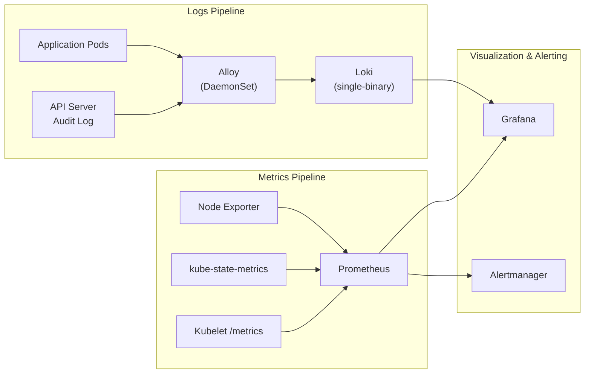
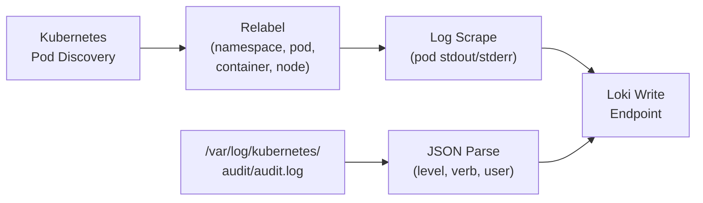
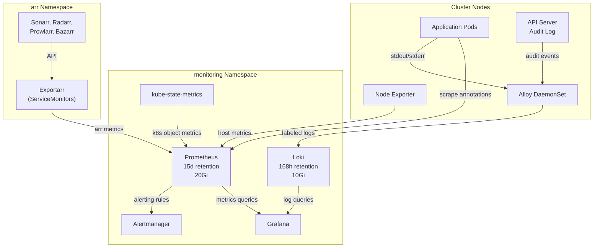

# Monitoring & Observability

This document covers the full monitoring and observability stack, including metrics collection, log aggregation, visualization, and alerting.

## Observability Stack Overview

The monitoring stack provides two parallel data pipelines -- one for metrics and one for logs -- converging in Grafana for unified visualization.

## Component Inventory

| Component | Purpose | Deployment | Storage |
|-----------|---------|-----------|---------|
| Prometheus | Metrics collection, storage, and rule evaluation | StatefulSet | 20Gi PVC (`local-path`), 15d retention |
| Grafana | Dashboards and visualization for metrics and logs | Deployment | Persistent PVC (`nfs-client`) |
| Alertmanager | Alert routing, grouping, and notification | StatefulSet | Ephemeral |
| Node Exporter | Host-level hardware and OS metrics | DaemonSet | None |
| kube-state-metrics | Kubernetes object state metrics | Deployment | None |
| Loki | Log aggregation and querying | StatefulSet (single-binary) | 10Gi PVC (`nfs-client`), 168h retention |
| Alloy | Pod log collection and shipping | DaemonSet | None (streams to Loki) |
| Exportarr | Prometheus metrics exporter for *arr apps | Multi-Deployment (one per target) | None |
| Uptime Kuma | Synthetic HTTP/TCP/DNS monitoring | Deployment | 1Gi PVC (`nfs-client`) |
| VPA Recommender | Per-workload CPU/memory right-sizing recommendations | Deployment | None |
| Goldilocks | Auto-creates VPA CRs, provides recommendation dashboard | Deployment (controller + dashboard) | None |

## Metrics Pipeline

### Prometheus

Prometheus is deployed via the `kube-prometheus-stack` Helm chart (sync wave -1) and serves as the central metrics store.

| Setting | Value |
|---------|-------|
| Retention | 15 days |
| Storage | 20Gi PVC (`nfs-client`) |
| Access | `prometheus.homelab.local` |
| Sync Wave | -1 |

Prometheus scrapes metrics from:

- **Node Exporter** -- CPU, memory, disk, network, and other host-level metrics from every node
- **kube-state-metrics** -- Kubernetes object states (pod status, deployment replicas, node conditions)
- **Kubelet metrics** -- Container resource usage and pod lifecycle events
- **Exportarr** -- *arr application metrics (queue depth, library size, missing episodes) via ServiceMonitors
- **Application metrics** -- Any pods with Prometheus scrape annotations

### Alertmanager

Alertmanager receives alerts from Prometheus and handles deduplication, grouping, silencing, and routing.

| Setting | Value |
|---------|-------|
| Access | `alertmanager.homelab.local` |
| Deployment | Part of kube-prometheus-stack |

### Node Exporter

Node Exporter runs as a DaemonSet, ensuring one instance per node. It exposes host-level metrics including:

- CPU utilization and load averages
- Memory and swap usage
- Disk I/O and filesystem capacity
- Network interface statistics
- System temperature (where available)

### kube-state-metrics

kube-state-metrics generates metrics about Kubernetes object states by listening to the Kubernetes API server. Key metrics include:

- Pod phase and container status
- Deployment and StatefulSet replica counts
- PersistentVolume and PVC status
- Node conditions and resource capacity

## Logs Pipeline

### Loki

Loki runs in **single-binary mode**, combining all Loki components (distributor, ingester, querier, compactor) in a single process. This simplifies deployment for a homelab-scale cluster.

| Setting | Value |
|---------|-------|
| Mode | Single-binary (monolithic) |
| Retention | 168 hours (7 days) |
| Storage | 10Gi PVC (`nfs-client`), filesystem backend |
| Access | Via Grafana data source |
| Sync Wave | -1 |

!!! info "Filesystem Backend"
    Loki uses the local filesystem (backed by NFS PVC) for chunk and index storage. This avoids the need for an external object store while providing persistence across pod restarts.

### Alloy

Alloy is Grafana's OpenTelemetry-compatible collector, deployed as a **DaemonSet** to collect logs from every node. It replaced Promtail as the recommended log collector.

| Setting | Value |
|---------|-------|
| Deployment | DaemonSet |
| Source | Pod logs via Kubernetes discovery |
| Destination | Loki |
| Sync Wave | 0 |

#### Alloy Pipeline Configuration

Alloy uses a pipeline-based configuration that discovers, filters, relabels, and ships logs:

1. **Discovery:** Alloy uses the Kubernetes discovery mechanism to find all running pods on the node
2. **Relabeling:** Extracts and attaches metadata labels:
    - `namespace` -- Kubernetes namespace
    - `pod` -- Pod name
    - `container` -- Container name
    - `node` -- Node the pod is running on
3. **Log scrape:** Reads `stdout`/`stderr` log streams from discovered pods
4. **Audit log collection:** Tails the kube-apiserver audit log from the host filesystem and parses JSON fields into labels (see [Kubernetes Audit Logging](#kubernetes-audit-logging))
5. **Loki write:** Ships labeled log entries to Loki's push API

## Kubernetes Audit Logging

The Kubernetes API server is configured to write structured audit events to a log file on the control plane node. Alloy tails this file and ships the events to Loki.

### Audit Policy

The audit policy (`/etc/kubernetes/audit/audit-policy.yml`) defines what gets logged:

| Event Category | Audit Level | Examples |
|---------------|-------------|---------|
| Secret mutations | RequestResponse | create, update, delete, patch on secrets |
| RBAC changes | RequestResponse | Changes to roles, clusterroles, and bindings |
| Auth events | RequestResponse | Token reviews, certificate signing requests |
| Infrastructure mutations | RequestResponse | Namespace, node, and PV changes |
| All other mutations | Metadata | Any create, update, delete, patch |
| Read operations | Metadata | Remaining get requests |
| Noise (filtered out) | None | Health checks, watches, lists, lease heartbeats |

### Log Rotation

Audit logs are rotated by the API server:

- **Max age:** 7 days
- **Max backups:** 3 files
- **Max size:** 100 MB per file

### Querying Audit Logs

In Grafana Explore, query Loki with:

- `{job="kubernetes-audit"}` -- all audit events
- `{job="kubernetes-audit", verb="delete"}` -- all delete operations
- `{job="kubernetes-audit", user="system:serviceaccount:argocd:argocd-server"}` -- events from a specific service account
- `{job="kubernetes-audit", level="RequestResponse"} |= "secrets"` -- secret access with full request/response bodies

## Grafana

Grafana provides a unified interface for exploring both metrics (Prometheus) and logs (Loki).

| Setting | Value |
|---------|-------|
| Access | `grafana.homelab.local` |
| Storage | Persistent PVC (`nfs-client`) |
| Admin Credentials | ExternalSecret (`grafana-admin`, synced from Vault) |

### Pre-Configured Data Sources

| Data Source | Type | Purpose |
|------------|------|---------|
| Prometheus | Metrics | Default metrics data source for dashboards |
| Loki | Logs | Log exploration and correlation with metrics |

Grafana is deployed with both data sources pre-configured via Helm values, eliminating manual setup after deployment.

!!! tip "Log Correlation"
    Use Grafana's split view to correlate metrics spikes with log entries. Select a time range on a Prometheus dashboard panel and switch to the Explore view with Loki to see logs from the same period.

## Capacity Planning

The cluster includes a capacity planning layer that surfaces resource right-sizing data and cluster-wide headroom visibility.

### VPA + Goldilocks

The Vertical Pod Autoscaler (VPA) recommender analyzes historical CPU and memory usage for each workload and computes right-sizing recommendations. Goldilocks automatically creates a VPA CR for every Deployment and StatefulSet in the cluster, eliminating manual VPA object management.

- **VPA Recommender**: Runs in `kube-system`, computes target/lower-bound/upper-bound recommendations, exposes `vpa_status_recommendation` Prometheus metrics
- **Goldilocks Controller**: Watches all namespaces (except `kube-node-lease`, `kube-public`) and creates `VerticalPodAutoscaler` CRs with `updateMode: "Off"`
- **Goldilocks Dashboard**: Web UI for browsing per-workload recommendations (access via `kubectl port-forward`)

VPA runs in recommend-only mode -- no pods are ever mutated. Recommendations are advisory and applied through manual manifest updates.

### Capacity Dashboards

Two custom Grafana dashboards (provisioned via sidecar ConfigMaps) complement the Goldilocks per-workload view with cluster-wide capacity data:

| Dashboard | Purpose |
|-----------|---------|
| Cluster Capacity Overview | CPU/memory requested vs allocatable vs used (timeseries + gauges), pod count, namespace breakdown pie charts |
| Namespace Resource Breakdown | Per-namespace tables with requests, limits, usage, and efficiency %, stacked usage timeseries |

These dashboards answer "how much headroom does the cluster have?" while Goldilocks answers "what should each workload request?"

## Data Flow Summary

