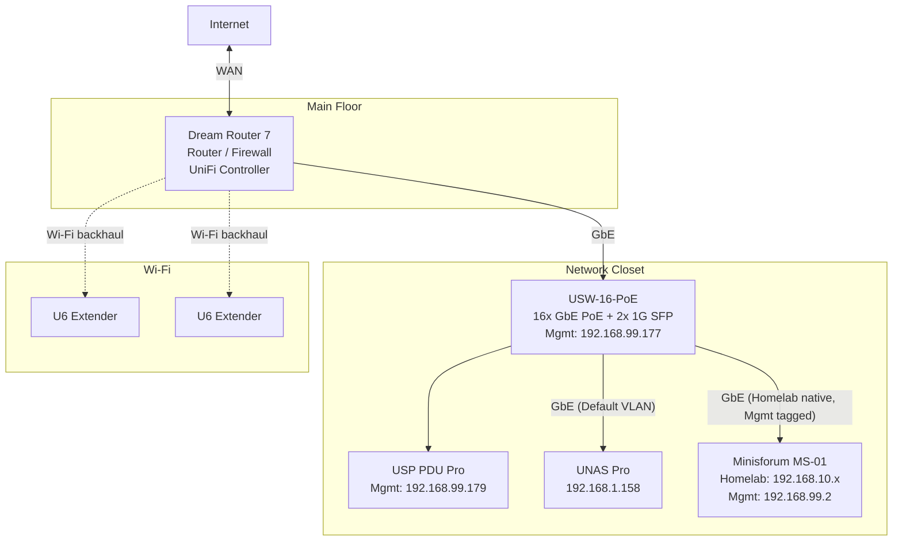
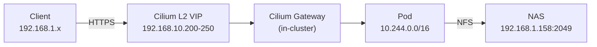

# Network Infrastructure

Physical and logical network architecture below Kubernetes: VLANs, firewall rules, DNS, and remote access. For Kubernetes-level networking (Cilium Gateway API, TLS, network policies, VPN sidecar), see [Networking](networking.md).

## Physical Topology

All physical links are Gigabit Ethernet. See [Hardware Inventory](../reference/hardware.md) for full device specs.

## VLANs

| VLAN ID | Name | Subnet | Purpose |
|---------|------|--------|---------|
| 1 | Default | 192.168.1.0/24 | Household devices, NAS data plane, Wi-Fi clients |
| 10 | Homelab | 192.168.10.0/24 | Proxmox host, Kubernetes VMs, cluster services |
| 99 | Management | 192.168.99.0/24 | Infrastructure management interfaces (Proxmox, switch, PDU) |

The NAS sits on the Default VLAN (192.168.1.158) because it serves both household devices and the Kubernetes cluster. The UNAS Pro does not support dual-homing, so its management interface remains on the Default VLAN.

The MS-01's switch port is a trunk: Homelab (10) as the native VLAN for data traffic, Management (99) tagged for the Proxmox management subinterface.

## Firewall Rules

Configured in the UniFi Network controller on the Dream Router 7. Rules are evaluated in order.

### Zone Defaults

The Management and Homelab zones block all traffic to and from other zones by default (except External and Gateway). This provides isolation without explicit deny rules.

### Custom Rules

| # | Source | Destination | Action | Purpose |
|---|--------|-------------|--------|---------|
| 1 | Internal | Management | Allow | Admin access from home network |
| 2 | Internal | Homelab | Allow | Home network access to homelab services |
| 3 | Homelab | Internal -- 192.168.1.158 (NAS) | Allow | Kubernetes NFS access to NAS |

Rule 3 is scoped to the NAS IP only -- Homelab VLAN devices cannot reach other devices on the Default VLAN. Management VLAN outbound to External and Gateway is allowed by zone defaults (for updates, NTP).

## DNS

Static entries for each `*.homelab.local` service are configured in the UniFi Network controller's local DNS records, pointing to the Cilium L2 gateway VIP.

See [Networking - Application Hostnames](networking.md#application-hostnames) for the full hostname list.

## Remote Access

| Method | Status |
|--------|--------|
| WireGuard VPN | Server enabled on Dream Router 7 |
| UniFi Teleport | Enabled |

## Kubernetes Network Integration

How the physical network connects to the Kubernetes pod network:

| Network | CIDR | Purpose |
|---------|------|---------|
| Default VLAN | 192.168.1.0/24 | Client access, NAS data plane |
| Homelab VLAN | 192.168.10.0/24 | Node IPs, Cilium L2 VIPs |
| Management VLAN | 192.168.99.0/24 | Infrastructure management (not used by Kubernetes) |
| Pod network | 10.244.0.0/16 | Kubernetes pod CIDR (Cilium) |
| Service network | 10.96.0.0/12 | Kubernetes service CIDR |
| L2 VIP pool | 192.168.10.200-250 | Cilium LoadBalancer IPs |
