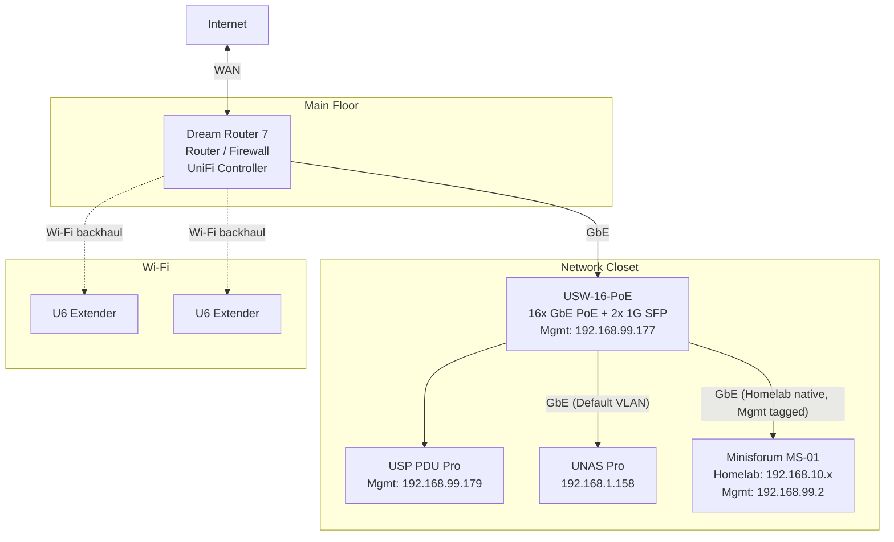
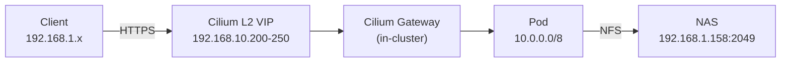

# Network Infrastructure

Physical and logical network architecture below Kubernetes: VLANs, firewall rules, DNS, and remote access. For Kubernetes-level networking (Cilium Gateway API, TLS, network policies, VPN sidecar), see [Networking](networking.md).

## Physical Topology

```mermaid
flowchart TD
    internet["Internet"] <-->|"WAN"| DR7

    subgraph main_floor ["Main Floor"]
        DR7["Dream Router 7<br/>Router / Firewall<br/>UniFi Controller"]
    end

    subgraph closet ["Network Closet"]
        SW["USW-16-PoE<br/>16x GbE PoE + 2x 1G SFP<br/>Mgmt: 192.168.99.177"]
        PDU["USP PDU Pro<br/>Mgmt: 192.168.99.179"]
        NAS["UNAS Pro<br/>192.168.1.158"]
        MS01["Minisforum MS-01<br/>Homelab: 192.168.10.x<br/>Mgmt: 192.168.99.2"]
    end

    subgraph wifi ["Wi-Fi"]
        U6a["U6 Extender"]
        U6b["U6 Extender"]
    end

    DR7 -->|"GbE"| SW
    SW -->|"GbE (Default VLAN)"| NAS
    SW -->|"GbE (Homelab native, Mgmt tagged)"| MS01
    SW --> PDU
    DR7 -.->|"Wi-Fi backhaul"| U6a
    DR7 -.->|"Wi-Fi backhaul"| U6b
```

All physical links are Gigabit Ethernet. See [Hardware Inventory](../reference/hardware.md) for full device specs.

## VLANs

| VLAN ID | Name | Subnet | Purpose |
|---------|------|--------|---------|
| 1 | Default | 192.168.1.0/24 | Household devices, NAS data plane, Wi-Fi clients |
| 10 | Homelab | 192.168.10.0/24 | Proxmox host, Kubernetes VMs, cluster services |
| 99 | Management | 192.168.99.0/24 | Infrastructure management interfaces (Proxmox, switch, PDU) |

The NAS sits on the Default VLAN (192.168.1.158) because it serves both household devices and the Kubernetes cluster. The UNAS Pro does not support dual-homing, so its management interface remains on the Default VLAN.

The MS-01's switch port is a trunk: Homelab (10) as the native VLAN for data traffic, Management (99) tagged for the Proxmox management subinterface.

### DHCP Scopes

| VLAN | Scope | Notes |
|------|-------|-------|
| Default | 192.168.1.6 -- 192.168.1.254 | Household devices |
| Homelab | 192.168.10.161 -- 192.168.10.190 | Aligned to `192.168.10.160/27` |
| Management | 192.168.99.6 -- 192.168.99.254 | Switch and PDU take addresses here |

The Homelab scope is deliberately narrow. It sits above the statically addressed infrastructure (`.2` Proxmox, `.50`--`.52` nodes) and below the Cilium LoadBalancer pool (`.200`--`.250`), so DHCP cannot issue an address that collides with a node or a live service VIP. The `/27` boundary is what the Management access firewall rule matches on.

### Switch Port Assignments

USW-16-PoE, from the switch MAC forwarding table and port configuration:

| Port | Device | VLAN |
|------|--------|------|
| 1 | Uplink to Dream Router 7 | Trunk |
| 2 | MS-01 `nic0` | Native Homelab (10), tagged Management (99) |
| 4 | Reserved for out-of-band management | Native Management (99) |
| 5 | USP PDU Pro | Management (99) |
| 7 | UNAS Pro | Default (1) |

Port 2 carries both the Proxmox host and every Kubernetes VM, since the VMs bridge onto `vmbr0`. A cable in the wrong port therefore takes the entire cluster off the Homelab VLAN while leaving the host running -- the machine stays up and reachable from its own console, but nothing on the network can see it.

## Firewall Rules

Configured in the UniFi Network controller on the Dream Router 7. Rules are evaluated in order.

### Zone Defaults

The Management and Homelab zones block all traffic to and from other zones by default (except External and Gateway). This provides isolation without explicit deny rules.

### Custom Rules

| # | Source | Destination | Action | Purpose |
|---|--------|-------------|--------|---------|
| 1 | Internal | Homelab | Allow | Home network access to homelab services |
| 2 | Homelab | Internal -- 192.168.1.158 (NAS) | Allow | Kubernetes NFS access to NAS |
| 3 | Homelab -- 192.168.10.160/27 | Management | Allow | Workstation access to management interfaces |
| 4 | Vpn | Management | Allow | Remote management over WireGuard/Teleport |
| 5 | Vpn | Homelab | Allow | Remote access to cluster services over WireGuard/Teleport |

Rules 2 and 3 are scoped rather than zone-wide. Rule 2 permits only the NAS IP, so Homelab devices cannot reach other Default VLAN hosts. Rule 3 permits only the Homelab DHCP block, which excludes the Proxmox host and the Kubernetes nodes -- neither the hypervisor nor pod traffic masquerading behind a node IP can reach the Management VLAN.

Scoping rule 3 to the DHCP block rather than a single address is deliberate. The workstation uses a rotating private Wi-Fi address, so a MAC-pinned reservation or single-IP rule stops matching whenever the address rotates. Any address the workstation can be issued falls inside the block.

There is no explicit deny into Management. Isolation comes from the zone defaults above, so any source not listed here is refused.

Management VLAN outbound to External and Gateway is allowed by zone defaults (for updates, NTP).

## DNS

Static entries for each `*.homelab.local` service are configured in the UniFi Network controller's local DNS records, pointing to the Cilium L2 gateway VIP.

See [Networking - Application Hostnames](networking.md#application-hostnames) for the full hostname list.

## Remote Access

| Method | Status | Reaches |
|--------|--------|---------|
| WireGuard VPN | Server enabled on Dream Router 7, `192.168.3.0/24` | Homelab and Management |
| UniFi Teleport | Enabled | Homelab and Management |

Both land in the `Vpn` firewall zone, which rules 4 and 5 above permit into Homelab and Management. A VPN client therefore reaches cluster services, the Proxmox web UI on either interface, and the switch and PDU management pages.

There is no inbound path from the internet: no port forwards, no static routes, no reverse proxy. All `*.homelab.local` records resolve to a private address, so remote access requires the VPN.

## Kubernetes Network Integration

How the physical network connects to the Kubernetes pod network:

```mermaid
flowchart LR
    client["Client<br/>192.168.1.x"] -->|"HTTPS"| vip["Cilium L2 VIP<br/>192.168.10.200-250"]
    vip --> gateway["Cilium Gateway<br/>(in-cluster)"]
    gateway --> pod["Pod<br/>10.0.0.0/8"]
    pod -->|"NFS"| nas["NAS<br/>192.168.1.158:2049"]
```

| Network | CIDR | Purpose |
|---------|------|---------|
| Default VLAN | 192.168.1.0/24 | Client access, NAS data plane |
| Homelab VLAN | 192.168.10.0/24 | Node IPs, Cilium L2 VIPs |
| Management VLAN | 192.168.99.0/24 | Infrastructure management (not used by Kubernetes) |
| Pod network | 10.0.0.0/8 | Kubernetes pod CIDR (Cilium cluster-pool, /24 per node) |
| Service network | 10.96.0.0/12 | Kubernetes service CIDR |
| L2 VIP pool | 192.168.10.200-250 | Cilium LoadBalancer IPs |
