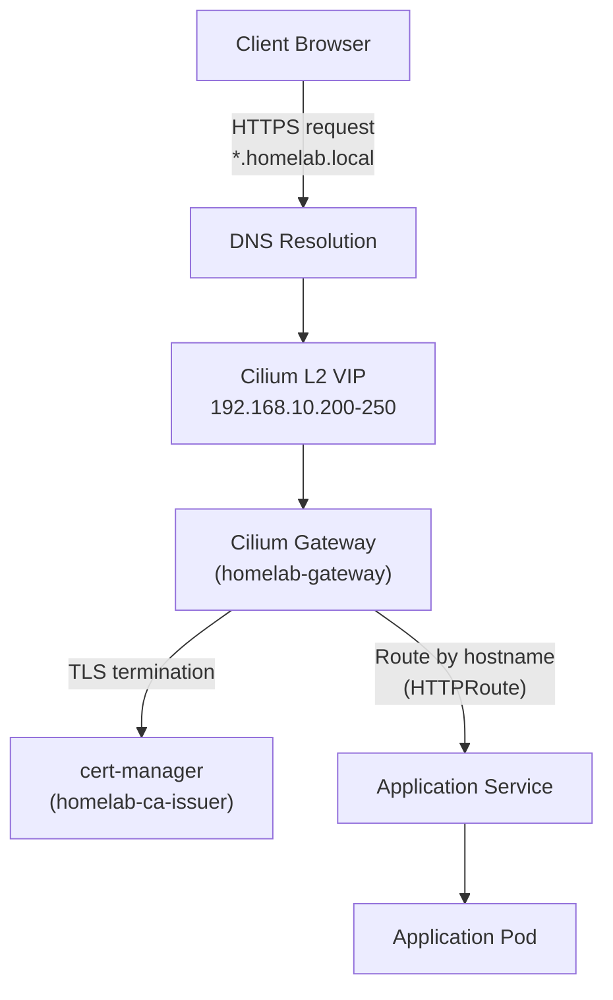
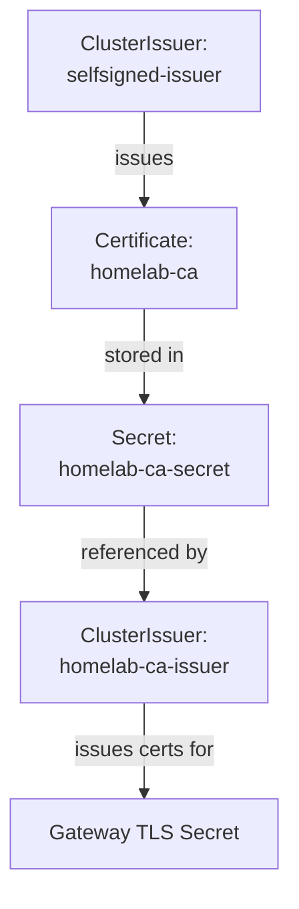
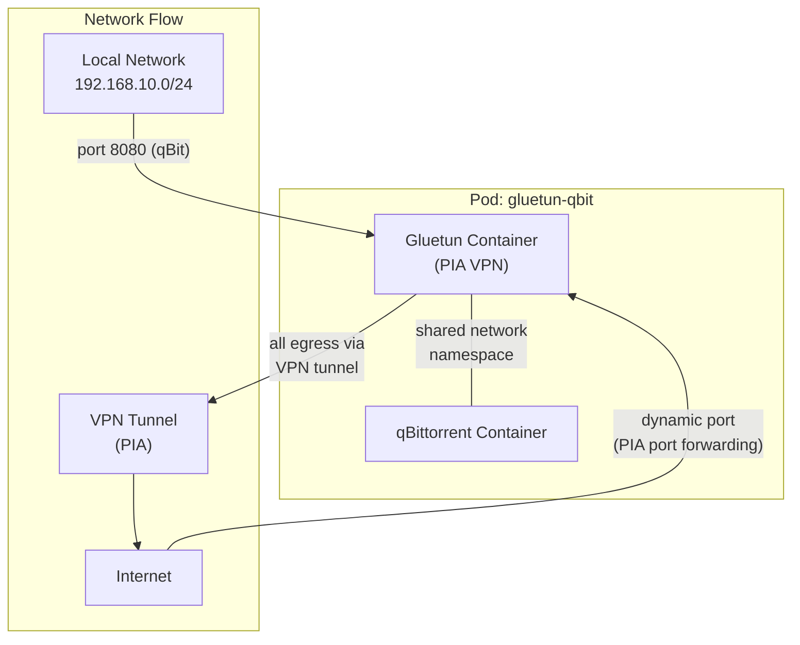

# Networking

This document covers the networking stack from external client access down to individual pods, including load balancing, gateway routing, TLS termination, DNS, and the VPN sidecar architecture.

## Network Architecture



## Cilium Gateway API

Cilium serves as both the CNI and the gateway controller. The `homelab-gateway` Gateway resource accepts HTTPS traffic on port 443 for `*.homelab.local` and terminates TLS using a cert-manager-issued wildcard certificate.

Each application defines an HTTPRoute that binds to the gateway and routes by hostname:

```yaml
route:
  main:
    enabled: true
    kind: HTTPRoute
    parentRefs:
      - group: gateway.networking.k8s.io
        kind: Gateway
        name: homelab-gateway
        namespace: default
        sectionName: https
    hostnames:
      - <app>.homelab.local
```

An HTTP-to-HTTPS redirect is configured via a separate HTTPRoute on the gateway's HTTP listener.

### Key Resources

| Resource | Kind | Purpose |
|----------|------|---------|
| `homelab-gateway` | Gateway | Central entry point for all HTTPS traffic |
| `homelab-pool` | CiliumLoadBalancerIPPool | Allocates IPs from `192.168.10.200-250` |
| `homelab-l2` | CiliumL2AnnouncementPolicy | Advertises allocated IPs via ARP on the LAN |
| Per-app routes | HTTPRoute | Hostname-based routing to each application service |

## Cilium L2 Announcements

Cilium replaces MetalLB for LoadBalancer IP allocation. It operates in Layer 2 mode, responding to ARP requests on the local network to advertise virtual IPs from the `homelab-pool`.

- **IP Address Pool:** `192.168.10.200` - `192.168.10.250`
- **Mode:** L2 ARP announcement
- **Consumers:** The `homelab-gateway` Gateway and any LoadBalancer services (e.g., Jellyfin)

!!! note "L2 Limitations"
    In L2 mode, all traffic for a given VIP is handled by a single node (the current ARP responder). Failover occurs when the node becomes unavailable, at which point another node takes over the VIP.

## Cert-Manager and the CA Chain

TLS certificates are issued by a self-signed CA chain managed entirely within the cluster by cert-manager.



### CA Chain Components

| Resource | Kind | Purpose |
|----------|------|---------|
| `selfsigned-issuer` | ClusterIssuer | Bootstrap issuer that signs the CA certificate |
| `homelab-ca` | Certificate | The root CA certificate, signed by the self-signed issuer |
| `homelab-ca-secret` | Secret | Stores the CA key pair, referenced by the CA issuer |
| `homelab-ca-issuer` | ClusterIssuer | Issues TLS certificates for the Gateway using the CA |

The Gateway resource includes a `cert-manager.io/cluster-issuer: homelab-ca-issuer` annotation. cert-manager automatically provisions a wildcard TLS certificate for `*.homelab.local` and stores it in the `homelab-gateway-tls` Secret.

!!! tip "Trusting the CA"
    To avoid browser warnings, import the `homelab-ca` certificate into your operating system or browser trust store. The CA certificate can be extracted from the `homelab-ca-secret` Secret in the `cert-manager` namespace.

## DNS

All services use the `*.homelab.local` domain pattern. DNS resolution is handled at the network level (router or local DNS server) pointing `*.homelab.local` to the Cilium L2 VIP assigned to the `homelab-gateway` Gateway.

### Application Hostnames

| Application | Hostname |
|------------|----------|
| Jellyfin | `jellyfin.homelab.local` |
| Sonarr | `sonarr.homelab.local` |
| Radarr | `radarr.homelab.local` |
| Prowlarr | `prowlarr.homelab.local` |
| Bazarr | `bazarr.homelab.local` |
| Jellyseerr | `jellyseerr.homelab.local` |
| qBittorrent | `qbit.homelab.local` |
| Tdarr | `tdarr.homelab.local` |
| Homepage | `home.homelab.local` |
| Uptime Kuma | `status.homelab.local` |
| Authentik | `auth.homelab.local` |
| Grafana | `grafana.homelab.local` |
| Prometheus | `prometheus.homelab.local` |
| Alertmanager | `alertmanager.homelab.local` |
| Vault | `vault.homelab.local` |
| OpenClaw | `openclaw.homelab.local` |

## Network Policies

CiliumNetworkPolicies enforce namespace-level ingress isolation. Each application namespace has a default-deny rule for external traffic, with explicit allow rules for the gateway, intra-namespace communication, and Prometheus scraping. See the [Network Policies infrastructure page](../infrastructure/network-policies.md) for the full policy breakdown per namespace.

## VPN Sidecar Architecture

qBittorrent runs alongside a Gluetun VPN container in a shared pod. Both containers share a single network namespace, meaning all egress traffic from qBittorrent routes through the VPN tunnel.



### Gluetun Configuration

| Setting | Value |
|---------|-------|
| VPN Provider | Private Internet Access (PIA) |
| Server Region | CA Montreal |
| Capability | `NET_ADMIN` (required for VPN tunnel creation) |
| Firewall - qBittorrent | Port 8080 |
| Port Forwarding | `VPN_PORT_FORWARDING=on` (PIA assigns port dynamically) |
| Credentials | ExternalSecret (`vpn-credentials`, synced from Vault) |

Gluetun creates the VPN tunnel interface and configures iptables firewall rules. The `NET_ADMIN` capability is required for tunnel and firewall management. Because the containers share a network namespace, qBittorrent automatically uses the VPN tunnel for all outbound connections.

!!! warning "Kill Switch"
    If the VPN tunnel drops, Gluetun's built-in firewall rules prevent any traffic from leaving the pod outside the tunnel. This acts as a kill switch ensuring download traffic is never exposed on the local network.
