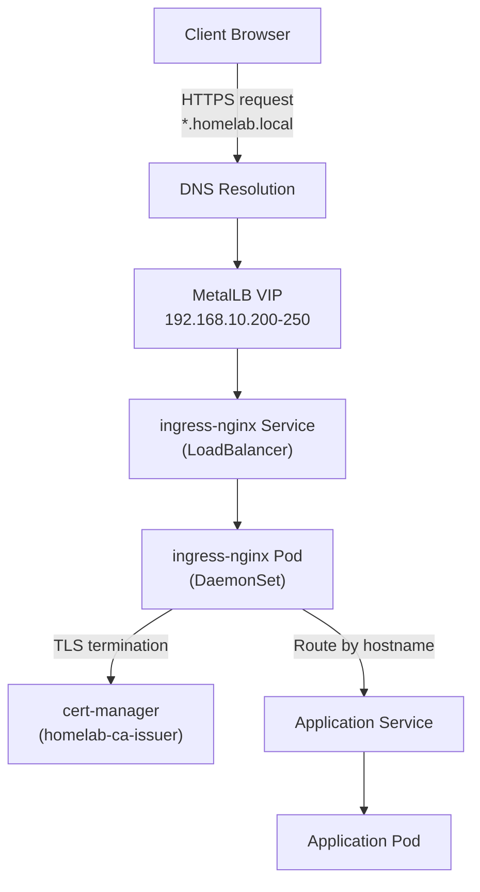
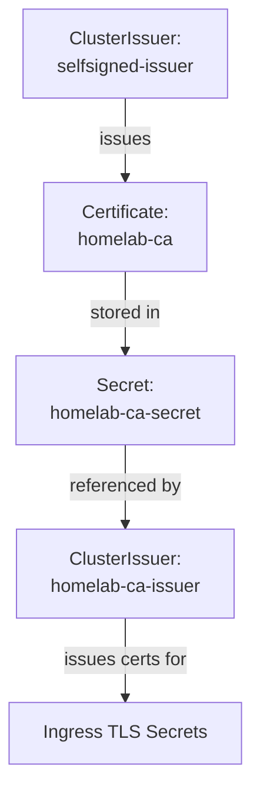
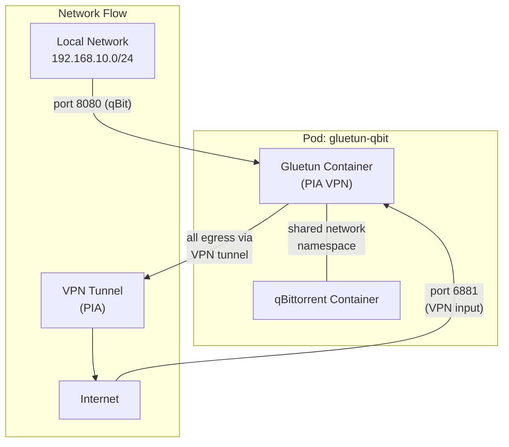

# Networking

This document covers the networking stack from external client access down to individual pods, including load balancing, ingress routing, TLS termination, DNS, and the VPN sidecar architecture.

## Network Architecture

## MetalLB

MetalLB provides LoadBalancer-type Service support for the bare-metal cluster. It operates in **Layer 2 (L2) mode**, responding to ARP requests on the local network to advertise virtual IPs.

### Configuration

- **IP Address Pool:** `192.168.10.200` - `192.168.10.250`
- **Mode:** L2Advertisement (ARP-based)
- **Sync Wave:** -3 (controller), -2 (pool and advertisement configuration)

MetalLB assigns IPs from the pool to any Service of type `LoadBalancer`. The primary consumer is the ingress-nginx Service, though other services can request dedicated IPs as needed.

!!! note "L2 Limitations"
    In L2 mode, all traffic for a given VIP is handled by a single node (the current ARP responder). Failover occurs when the node becomes unavailable, at which point another node takes over the VIP.

## Ingress-Nginx

The ingress-nginx controller runs as a **DaemonSet**, placing one controller pod on every node. This ensures ingress capacity scales with the cluster and eliminates single-node bottlenecks.

- **Deployment mode:** DaemonSet
- **Service type:** LoadBalancer (MetalLB assigns the VIP)
- **TLS:** Terminated at the ingress controller using certificates issued by cert-manager
- **Sync Wave:** -1

All applications expose themselves through Ingress resources with `*.homelab.local` hostnames. The ingress controller routes requests to the correct backend Service based on the `Host` header.

## Cert-Manager and the CA Chain

TLS certificates are issued by a self-signed CA chain managed entirely within the cluster by cert-manager.

### CA Chain Components

| Resource | Kind | Purpose |
|----------|------|---------|
| `selfsigned-issuer` | ClusterIssuer | Bootstrap issuer that signs the CA certificate |
| `homelab-ca` | Certificate | The root CA certificate, signed by the self-signed issuer |
| `homelab-ca-secret` | Secret | Stores the CA key pair, referenced by the CA issuer |
| `homelab-ca-issuer` | ClusterIssuer | Issues TLS certificates for Ingress resources using the CA |

When an Ingress resource includes a `cert-manager.io/cluster-issuer: homelab-ca-issuer` annotation, cert-manager automatically provisions a TLS certificate signed by the homelab CA and stores it in the referenced Secret.

!!! tip "Trusting the CA"
    To avoid browser warnings, import the `homelab-ca` certificate into your operating system or browser trust store. The CA certificate can be extracted from the `homelab-ca-secret` Secret in the `cert-manager` namespace.

## DNS

All services use the `*.homelab.local` domain pattern. DNS resolution is handled at the network level (router or local DNS server) pointing `*.homelab.local` to the MetalLB VIP assigned to the ingress-nginx Service.

### Application Hostnames

| Application | Hostname |
|------------|----------|
| Jellyfin | `jellyfin.homelab.local` |
| Sonarr | `sonarr.homelab.local` |
| Radarr | `radarr.homelab.local` |
| Prowlarr | `prowlarr.homelab.local` |
| Bazarr | `bazarr.homelab.local` |
| Jellyseerr | `jellyseerr.homelab.local` |
| qBittorrent | `qbit.homelab.local` |
| Tdarr | `tdarr.homelab.local` |
| Homepage | `home.homelab.local` |
| Uptime Kuma | `status.homelab.local` |
| Authentik | `auth.homelab.local` |
| Grafana | `grafana.homelab.local` |
| Prometheus | `prometheus.homelab.local` |
| Alertmanager | `alertmanager.homelab.local` |

## Network Policies

CiliumNetworkPolicies enforce namespace-level ingress isolation. Each application namespace has a default-deny rule for external traffic, with explicit allow rules for ingress-nginx, intra-namespace communication, and Prometheus scraping. See the [Network Policies infrastructure page](../infrastructure/network-policies.md) for the full policy breakdown per namespace.

## VPN Sidecar Architecture

qBittorrent runs alongside a Gluetun VPN container in a shared pod. Both containers share a single network namespace, meaning all egress traffic from qBittorrent routes through the VPN tunnel.

### Gluetun Configuration

| Setting | Value |
|---------|-------|
| VPN Provider | Private Internet Access (PIA) |
| Capability | `NET_ADMIN` (required for VPN tunnel creation) |
| Firewall - qBittorrent | Port 8080 |
| VPN Input Port | 6881 (for incoming torrent connections) |
| Credentials | ExternalSecret (`vpn-credentials`, synced from Vault) |

Gluetun creates the VPN tunnel interface and configures iptables firewall rules. The `NET_ADMIN` capability is required for tunnel and firewall management. Because the containers share a network namespace, qBittorrent automatically uses the VPN tunnel for all outbound connections.

!!! warning "Kill Switch"
    If the VPN tunnel drops, Gluetun's built-in firewall rules prevent any traffic from leaving the pod outside the tunnel. This acts as a kill switch ensuring download traffic is never exposed on the local network.
