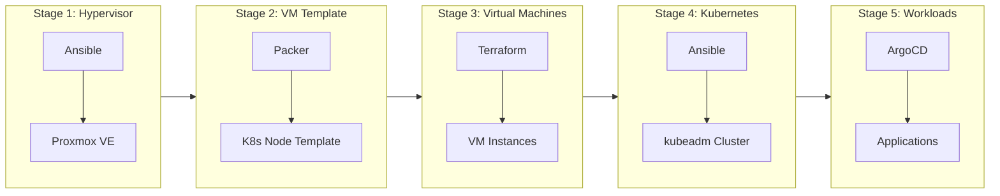

# Architecture Overview

This document provides a high-level view of the homelab infrastructure, covering the full provisioning pipeline, component inventory, and naming conventions.

## Provisioning Pipeline

The homelab is provisioned through a multi-stage pipeline that takes bare-metal hardware to a fully operational Kubernetes cluster running production-grade workloads.



**Stage 1 -- Hypervisor Provisioning:** Ansible configures the Proxmox VE hypervisor nodes, managing host-level settings, storage pools, and network bridges.

**Stage 2 -- VM Template:** Packer builds a K8s-ready Ubuntu 24.04 VM template on Proxmox using the `proxmox-iso` builder with Ubuntu autoinstall. The template is provisioned with Ansible roles (`base`, `k8s_prereqs`, `nfs`, `igpu`) so every node cloned from it already has the container runtime, kubeadm, NFS client, and iGPU drivers installed.

**Stage 3 -- VM Provisioning:** Terraform clones the Packer-built template to provision VMs, assigning per-node compute resources, IP addresses, and PCI device passthrough via cloud-init.

**Stage 4 -- Kubernetes Bootstrap:** Ansible bootstraps the kubeadm-based Kubernetes cluster, handling NFS mounts, iGPU device verification, control plane initialization, worker node joins, and CNI (Cilium) deployment. Roles already baked into the template are conditionally skipped.

**Stage 5 -- Workload Deployment:** ArgoCD manages all cluster workloads declaratively via GitOps. An app-of-apps pattern with directory recursion deploys infrastructure components and applications in the correct order using sync waves.

## Component Inventory

| Component | Role | Namespace |
|------|------|-----------|
| Cilium | Container Network Interface (CNI) | `kube-system` |
| ArgoCD | GitOps continuous delivery | `argocd` |
| Cilium Gateway API | Gateway controller + L2 LoadBalancer IP allocation | `default` |
| cert-manager | TLS certificate management (self-signed CA) | `cert-manager` |
| Vault | Centralized secrets backend (KV v2) | `vault` |
| External Secrets Operator | Syncs Vault secrets into K8s Secrets | `external-secrets` |
| NFS Provisioner | Dynamic NFS-backed PVC provisioning | `nfs-provisioner` |
| Metrics Server | Kubernetes resource metrics API | `kube-system` |
| MinIO | S3-compatible object storage for backups | `backups` |
| Intel GPU Operator | Intel GPU device driver management | `intel-gpu-operator` |
| Intel GPU Plugin | Intel iGPU device plugin for workloads | `intel-gpu-operator` |
| kube-prometheus-stack | Prometheus, Grafana, Alertmanager, Node Exporter, kube-state-metrics | `monitoring` |
| Loki | Log aggregation (single-binary mode) | `monitoring` |
| Velero | Cluster and volume backup/restore | `backups` |
| Alloy | DaemonSet log collector | `monitoring` |
| Authentik | SSO provider (forward-auth + OIDC) | `auth` |
| Reloader | Automatic pod restarts on ConfigMap/Secret changes | `kube-system` |
| Kyverno | Kubernetes policy engine (admission control) | `kyverno` |
| Descheduler | Pod rebalancing across nodes (CronJob) | `kube-system` |
| Jellyfin | Media server | `arr` |
| Sonarr | TV series management | `arr` |
| Radarr | Movie management | `arr` |
| Prowlarr | Indexer management | `arr` |
| Bazarr | Subtitle management | `arr` |
| Jellyseerr | Media request management | `arr` |
| qBittorrent | Torrent client (via Gluetun VPN sidecar) | `arr` |
| Recyclarr | Quality profile sync (CronJob) | `arr` |
| Tdarr | Media transcoding | `arr` |
| Exportarr | Prometheus exporter for *arr app metrics | `arr` |
| Homepage | Dashboard | `arr` |
| Uptime Kuma | Synthetic monitoring and status page | `monitoring` |
| OpenClaw | AI agents for cluster ops and media management | `openclaw` |

## Naming Conventions

Consistent naming across the infrastructure simplifies management, documentation, and troubleshooting.

| Pattern | Example | Description |
|---|---|---|
| `homelabpve##` | `homelabpve01` | Proxmox VE hypervisor nodes |
| `homelabk8s##` | `homelabk8s01` | Kubernetes cluster identifiers |
| `cluster-node-#` | `homelabk8s01-node-1` | Individual Kubernetes nodes within a cluster |

## Repository Structure

The repository is organized by tool and cluster:

```
homelab/
  packer/            # VM template builds
    k8s-node/        # K8s node template (Ubuntu 24.04 + autoinstall)
  ansible/           # Playbooks for Proxmox and K8s provisioning
  terraform/         # VM provisioning on Proxmox
  k8s/
    bootstrap/       # ArgoCD bootstrap and root application
    clusters/
      homelabk8s01/  # Cluster-specific ArgoCD Applications
        apps/        # Application workloads
        infrastructure/  # Infrastructure components
  docs/              # MkDocs documentation
```

!!! info "Single Source of Truth"
    The Git repository is the single source of truth for all cluster state. Manual changes made directly to the cluster will be detected and reverted by ArgoCD's automated sync with pruning and self-healing enabled.
