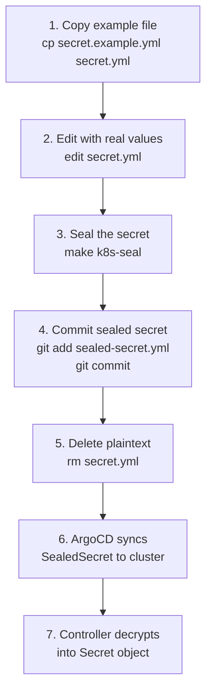

# Secret Management

This document covers the Sealed Secrets workflow used to safely store encrypted secrets in Git, the controller architecture, and disaster recovery considerations.

## Overview

[Sealed Secrets](https://github.com/bitnami-labs/sealed-secrets) by Bitnami allows Kubernetes Secrets to be stored in Git in encrypted form. A cluster-side controller decrypts `SealedSecret` custom resources into standard `Secret` objects at runtime.


### How It Works

1. The Sealed Secrets controller generates an asymmetric key pair (RSA) on first deployment
2. The **public key** is used by `kubeseal` to encrypt secrets locally
3. The **private key** remains in the cluster and is used by the controller to decrypt `SealedSecret` resources
4. Only the controller can decrypt sealed secrets -- the encrypted form is safe to commit to Git

## Controller Deployment

| Setting | Value |
|---------|-------|
| Chart | Bitnami Sealed Secrets |
| Namespace | `kube-system` |
| Sync Wave | -3 |

The controller is deployed at sync wave -3 to ensure it is available before any Application that references a SealedSecret.

## Workflow

The standard workflow for creating or updating a secret:

### Step-by-Step Process



### Commands

```bash
# 1. Copy the example secret template
cp secret.example.yml secret.yml

# 2. Edit with actual values (API keys, passwords, etc.)
$EDITOR secret.yml

# 3. Seal the secret using the Makefile target
make k8s-seal

# 4. Commit only the sealed (encrypted) version
git add sealed-secret.yml
git commit -m "Update sealed secret"

# 5. Delete the plaintext secret file
rm secret.yml
```

!!! danger "Never Commit Plaintext Secrets"
    The plaintext `secret.yml` file must never be committed to Git. Always delete it after sealing. The `.gitignore` should include patterns to prevent accidental commits of plaintext secret files.

## Secrets Inventory

The following sealed secrets are managed in the repository:

| Secret Name | Namespace | Purpose | Used By |
|------------|-----------|---------|---------|
| `vpn-credentials` | `arr` | PIA VPN username and password | Gluetun |
| `recyclarr-secrets` | `arr` | API keys for Sonarr and Radarr | Recyclarr |
| `homepage-secrets` | `arr` | API keys and service credentials | Homepage |
| `grafana-admin` | `monitoring` | Grafana admin username and password | Grafana |
| `minio-credentials` | `backups` | MinIO root user and password | MinIO |
| `velero-cloud-credentials` | `backups` | S3 access credentials for Velero | Velero |

## Disaster Recovery

!!! danger "Critical: Back Up the Controller Key"
    The Sealed Secrets controller's private key is essential for decrypting all sealed secrets. If the key is lost (e.g., cluster rebuild without backup), all existing SealedSecret resources become permanently undecryptable. You must back up the controller key.

### Backing Up the Key

```bash
# Export the controller's sealing key
kubectl get secret -n kube-system \
  -l sealedsecrets.bitnami.com/sealed-secrets-key \
  -o yaml > sealed-secrets-key-backup.yml
```

Store this backup securely outside the cluster (e.g., password manager, encrypted USB drive). Do not commit it to Git.

### Restoring the Key

When rebuilding a cluster, restore the key before deploying the Sealed Secrets controller:

```bash
# Apply the key backup before controller deployment
kubectl apply -f sealed-secrets-key-backup.yml

# Then deploy the controller (it will use the existing key)
```

If the controller starts before the key is restored, it generates a new key pair and existing SealedSecrets will fail to decrypt. In that case, delete the controller, apply the backup key, and redeploy.

### Re-Sealing After Key Loss

If the key backup is unavailable, all secrets must be re-created:

1. Gather original plaintext values from their sources (password managers, provider dashboards)
2. Create new plaintext secret files
3. Seal them with the new controller key
4. Commit the new sealed secrets
5. Delete plaintext files
