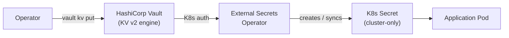
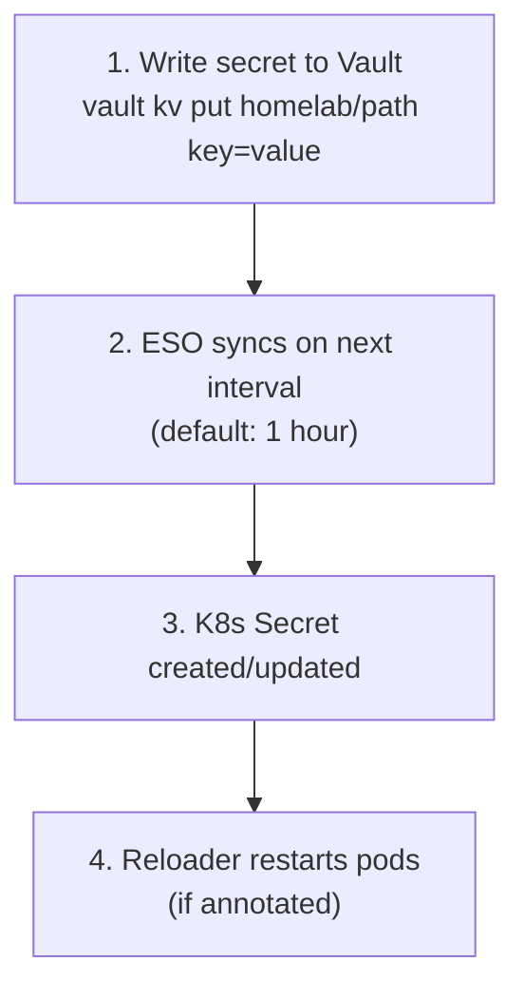

# Secret Management

This document covers the External Secrets Operator (ESO) workflow used to sync secrets from HashiCorp Vault into Kubernetes, the architecture, and disaster recovery considerations.

## Overview

Secrets are managed by [External Secrets Operator](https://external-secrets.io/) syncing from [HashiCorp Vault](https://www.vaultproject.io/). Vault stores all secret values in a KV v2 engine, and ESO pulls them into Kubernetes as native `Secret` objects on a configurable refresh interval.



### How It Works

1. Secrets are stored in Vault under the `homelab/` KV v2 mount
2. A `ClusterSecretStore` connects ESO to Vault using Kubernetes auth (no static tokens)
3. `ExternalSecret` resources in each namespace declare which Vault path and keys to sync
4. ESO periodically fetches values from Vault and creates or updates the corresponding K8s `Secret`
5. Pods consume the secrets as environment variables or volume mounts, as with any Kubernetes Secret

## Components

| Component | Namespace | Purpose |
|-----------|-----------|---------|
| Vault | `vault` | Secrets backend (KV v2 engine, standalone mode, file storage) |
| External Secrets Operator | `external-secrets` | Syncs Vault secrets into K8s Secret objects |
| ClusterSecretStore | `external-secrets` | Cluster-wide connection config for Vault |
| ExternalSecret | Various | Per-secret declaration of what to sync from Vault |

## Vault Path Structure

All secrets live under the `homelab` KV v2 mount, organized by layer:

| Vault Path | K8s Secret | Namespace |
|------------|------------|-----------|
| `infrastructure/minio` | `minio-credentials` | `backups` |
| `infrastructure/velero` | `velero-cloud-credentials` | `backups` |
| `infrastructure/authentik` | `authentik-credentials` | `auth` |
| `infrastructure/argocd-oidc` | `argocd-secret` (merge) | `argocd` |
| `infrastructure/argocd-notifications-slack` | `argocd-notifications-secret` (merge) | `argocd` |
| `infrastructure/grafana` | `grafana-admin` | `monitoring` |
| `infrastructure/grafana-oidc` | `grafana-oidc-secret` | `monitoring` |
| `infrastructure/alertmanager-slack` | `alertmanager-slack-webhook` | `monitoring` |
| `apps/vpn` | `vpn-credentials` | `arr` |
| `apps/recyclarr` | `recyclarr-secrets` | `arr` |
| `apps/exportarr` | `exportarr-secrets` | `arr` |
| `apps/unpackerr` | `unpackerr-secrets` | `arr` |
| `apps/homepage` | `homepage-secrets` | `arr` |
| `apps/openclaw` | `openclaw-secrets` | `openclaw` |
| `apps/openclaw` | `alertmanager-openclaw-hooks-token` | `monitoring` |

## Workflow

### Adding or Updating a Secret



```bash
# Port-forward to Vault (or use ingress at vault.homelab.local)
kubectl port-forward -n vault svc/vault 8200:8200

# Write or update a secret
vault kv put homelab/infrastructure/minio \
  rootUser=minioadmin \
  rootPassword=new_password

# Force an immediate sync (optional, otherwise waits for refreshInterval)
kubectl annotate externalsecret -n backups minio-credentials \
  force-sync=$(date +%s) --overwrite
```

### Adding a Secret for a New Application

1. Create an `ExternalSecret` YAML referencing a Vault path
2. Write the values into Vault at that path
3. Commit the `ExternalSecret` YAML and push -- ArgoCD syncs it
4. ESO creates the K8s Secret automatically

See the [adding an app runbook](../runbooks/adding-an-app.md) for the full workflow.

## Secret Rotation

Rotating a secret no longer requires re-sealing or Git commits:

```bash
# Update a single key (preserves other keys at the same path)
vault kv patch homelab/apps/vpn OPENVPN_PASSWORD=new_password

# Or replace all keys at a path (omitted keys are deleted)
vault kv put homelab/apps/vpn \
  OPENVPN_USER=new_user \
  OPENVPN_PASSWORD=new_password

# ESO picks up the change at the next refresh interval (1h default)
# Reloader automatically restarts affected pods
```

!!! warning
    `vault kv put` replaces **all** keys at a path. If you only specify one key, any other keys at that path are deleted. Use `vault kv patch` to update individual keys safely.

For immediate rotation, annotate the ExternalSecret to force a sync:

```bash
kubectl annotate externalsecret -n arr vpn-credentials \
  force-sync=$(date +%s) --overwrite
```

## Disaster Recovery

### Vault Backup

Vault data is stored on a PVC backed by NFS. Velero backs up all PVCs on schedule, so Vault data is included in cluster backups.

### Vault Unsealing

Vault is configured with AWS KMS auto-unseal. On every pod restart, Vault contacts AWS KMS to decrypt the master key automatically -- no manual intervention is required.

The AWS credentials used for auto-unseal are stored in the `vault-aws-kms` Kubernetes Secret in the `vault` namespace. This Secret is **never committed to Git** and must be recreated manually after a full cluster rebuild.

### Cluster Rebuild

When rebuilding the cluster from scratch:

1. **Before** running `make k8s-bootstrap`, create the `vault-aws-kms` Secret in the `vault` namespace with the AWS credentials and KMS key ID. See the [disaster recovery runbook](../runbooks/disaster-recovery.md#complete-cluster-rebuild) for the exact procedure.
2. Deploy Vault and ESO via ArgoCD (automatic from Git) -- Vault will auto-unseal via KMS.
3. Restore Vault data from Velero backup, or re-initialize with `make vault-init`.
4. If re-initializing, re-populate all secrets from their original sources.
5. ESO automatically creates all K8s Secrets once Vault is available.
