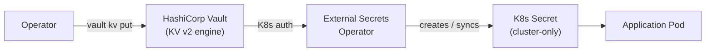
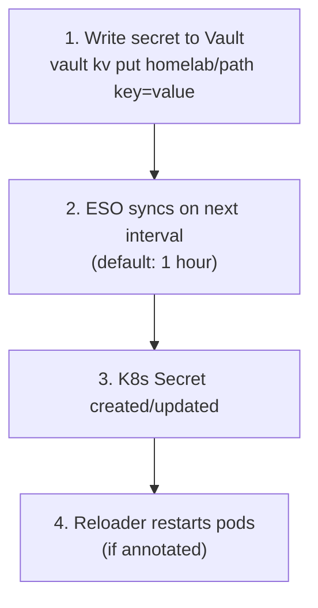

# Secret Management

This document covers the External Secrets Operator (ESO) workflow used to sync secrets from HashiCorp Vault into Kubernetes, the architecture, and disaster recovery considerations.

## Overview

Secrets are managed by [External Secrets Operator](https://external-secrets.io/) syncing from [HashiCorp Vault](https://www.vaultproject.io/). Vault stores all secret values in a KV v2 engine, and ESO pulls them into Kubernetes as native `Secret` objects on a configurable refresh interval.


```mermaid
flowchart LR
    operator["Operator"] -->|"vault kv put"| vault["HashiCorp Vault\n(KV v2 engine)"]
    vault -->|"K8s auth"| eso["External Secrets\nOperator"]
    eso -->|"creates / syncs"| secret["K8s Secret\n(cluster-only)"]
    secret --> app["Application Pod"]
```

### How It Works

1. Secrets are stored in Vault under the `homelab/` KV v2 mount
2. A `ClusterSecretStore` connects ESO to Vault using Kubernetes auth (no static tokens)
3. `ExternalSecret` resources in each namespace declare which Vault path and keys to sync
4. ESO periodically fetches values from Vault and creates or updates the corresponding K8s `Secret`
5. Pods consume the secrets as environment variables or volume mounts, as with any Kubernetes Secret

## Components

| Component | Namespace | Purpose |
|-----------|-----------|---------|
| Vault | `vault` | Secrets backend (KV v2 engine, one Raft voter, local storage) |
| External Secrets Operator | `external-secrets` | Syncs Vault secrets into K8s Secret objects |
| ClusterSecretStore | Cluster-scoped | Cluster-scoped connection config for Vault |
| ExternalSecret | Various | Per-secret declaration of what to sync from Vault |

## Vault Path Structure

All secrets live under the `homelab` KV v2 mount, organized by layer:

| Vault path (under `homelab/`) | Target Secret | Namespace |
|---|---|---|
| `infrastructure/argocd-notifications-slack` | `argocd-notifications-secret` | `argocd` |
| `infrastructure/argocd-oidc` | `argocd-secret` | `argocd` |
| `apps/arr` | `arr-api-keys` | `arr` |
| `apps/arr` | `arr-prowlarr-env` | `arr` |
| `apps/arr` | `arr-radarr-env` | `arr` |
| `apps/arr` | `arr-sonarr-env` | `arr` |
| `apps/arr` | `exportarr-secrets` | `arr` |
| `apps/homepage` | `homepage-secrets` | `arr` |
| `apps/jellyfin` | `jellyfin-credentials` | `arr` |
| `apps/opensubtitles` | `opensubtitles-credentials` | `arr` |
| `apps/qbittorrent`, `apps/unpackerr` | `qbittorrent-credentials` | `arr` |
| `apps/arr` | `recyclarr-secrets` | `arr` |
| `apps/seerr` | `seerr-api-key` | `arr` |
| `apps/tdarr` | `tdarr-api-key` | `arr` |
| `apps/arr`, `apps/unpackerr` | `unpackerr-secrets` | `arr` |
| `apps/vpn` | `vpn-credentials` | `arr` |
| `infrastructure/authentik` | `authentik-credentials` | `auth` |
| `infrastructure/etcd-backup` | `etcd-backup-credentials` | `backups` |
| `infrastructure/minio` | `minio-credentials` | `backups` |
| `infrastructure/velero` | `velero-cloud-credentials` | `backups` |
| `infrastructure/velero-offsite` | `velero-offsite-credentials` | `backups` |
| `infrastructure/alertmanager-heartbeat` | `alertmanager-heartbeat` | `monitoring` |
| `apps/openclaw` | `alertmanager-openclaw-hooks-token` | `monitoring` |
| `infrastructure/alertmanager-slack` | `alertmanager-slack-webhook` | `monitoring` |
| `infrastructure/grafana` | `grafana-admin` | `monitoring` |
| `infrastructure/grafana-oidc` | `grafana-oidc-secret` | `monitoring` |
| `apps/arr`, `apps/openclaw` | `openclaw-secrets` | `openclaw` |

The manifests define the complete property-level contract. Sonarr, Radarr and Prowlarr accept the shared API keys from Vault through injected environment variables. Bazarr and other first-boot generated credentials still require a tested adoption/bootstrap path. `make arr-keys-adopt` can adopt existing application keys without printing them or overwriting sibling fields.

## Workflow

### Adding or Updating a Secret


```mermaid
flowchart TD
    writeVault["1. Write secret to Vault\nvault kv put homelab/path key=value"] --> esoSync["2. ESO syncs on next interval\n(default: 1 hour)"]
    esoSync --> secretCreated["3. K8s Secret created/updated"]
    secretCreated --> reloader["4. Reloader restarts pods\n(if annotated)"]
```

```bash
# Port-forward to Vault (or use ingress at vault.homelab.local)
kubectl port-forward -n vault svc/vault 8200:8200

# Write or update a secret
vault kv put homelab/infrastructure/minio \
  rootUser=minioadmin \
  rootPassword=new_password

# Force an immediate sync (optional, otherwise waits for refreshInterval)
kubectl annotate externalsecret -n backups minio-credentials \
  force-sync=$(date +%s) --overwrite
```

### Adding a Secret for a New Application

1. Create an `ExternalSecret` YAML referencing a Vault path
2. Write the values into Vault at that path
3. Commit the `ExternalSecret` YAML and push -- ArgoCD syncs it
4. ESO creates the K8s Secret automatically

See the [adding an app runbook](../runbooks/adding-an-app.md) for the full workflow.

## Secret Rotation

Rotating a secret no longer requires re-sealing or Git commits:

```bash
# Update a single key (preserves other keys at the same path)
vault kv patch homelab/apps/vpn OPENVPN_PASSWORD=new_password

# Or replace all keys at a path (omitted keys are deleted)
vault kv put homelab/apps/vpn \
  OPENVPN_USER=new_user \
  OPENVPN_PASSWORD=new_password

# ESO picks up the change at the next refresh interval (1h default)
# Reloader restarts only workloads that explicitly opt in; otherwise roll out deliberately
```

!!! warning
    `vault kv put` replaces **all** keys at a path. If you only specify one key, any other keys at that path are deleted. Use `vault kv patch` to update individual keys safely.

For immediate rotation, annotate the ExternalSecret to force a sync:

```bash
kubectl annotate externalsecret -n arr vpn-credentials \
  force-sync=$(date +%s) --overwrite
```

## Disaster Recovery

### Vault Backup

Vault uses local Raft storage with daily native S3 snapshots, verified by downloading and comparing each upload. An isolated production snapshot restore passed with the original KMS key, cluster identity and secret values. The KMS key unlocks existing encrypted data; it does not recreate lost secrets.

Keep KMS credentials, recovery keys, backup-store credentials and required administrator access outside Vault. A restore cannot depend on ESO reading secrets from the Vault instance that is not yet restored. Reconnect or restore the correct data directory before starting recovery; initialize only an intentionally new backend or the empty native-snapshot target described in the recovery runbook.

See the [disaster recovery runbook](../runbooks/disaster-recovery.md) for the ordered procedure and the [backup runbook](../runbooks/backup-and-restore.md) for data-coverage limitations. Terraform state may also contain sensitive AWS access keys even though its outputs are marked sensitive; protect the state backend.

## CA Distribution

ArgoCD trusts the homelab CA through a trust-manager `Bundle` named `custom-ca-certs`, which
reads `homelab-ca-secret` and republishes it into the `argocd` namespace. A CA rotation therefore
propagates without a commit.

argocd-server mounts that bundle with `optional: true`. On a cold rebuild trust-manager does not
exist yet, and a required mount would deadlock the bootstrap. The pod needs one restart after the
CA first appears.
