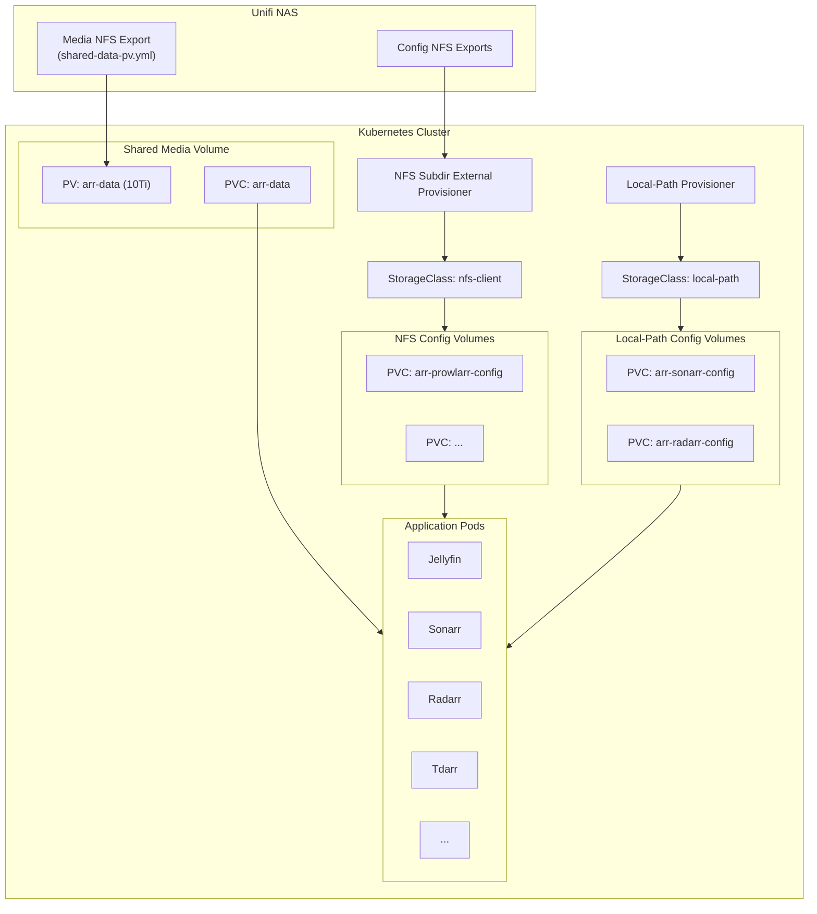

# Storage

This document covers the storage architecture, including the NFS dynamic provisioner, the shared media volume, per-application configuration volumes, and the NAS folder structure.

## Storage Architecture



## Storage Provisioners

### NFS Subdir External Provisioner

The NFS Subdir External Provisioner dynamically creates PersistentVolumes backed by subdirectories on the Unifi NAS. It eliminates the need to manually pre-create PVs for each application.

| Setting | Value |
|---------|-------|
| StorageClass Name | `nfs-client` |
| NFS Server | Unifi NAS |
| Path Pattern | `${.PVC.namespace}-${.PVC.name}` |
| Reclaim Policy | Retain |
| Sync Wave | -2 |

The `pathPattern` creates predictable directory names on the NAS. For example, a PVC named `arr-prowlarr-config` in the `arr` namespace creates the NFS subdirectory `arr-arr-prowlarr-config`.

!!! info "Default StorageClass"
    `nfs-client` serves as the default StorageClass for the cluster. Any PVC that does not specify a `storageClassName` will be provisioned by this provisioner.

### Local-Path Provisioner

The Rancher Local-Path Provisioner provides node-local storage for applications that require proper POSIX file locking, such as those using SQLite databases. NFS does not support the file locking primitives that SQLite requires, which causes database lock contention and potential corruption.

| Setting | Value |
|---------|-------|
| StorageClass Name | `local-path` |
| Volume Binding Mode | WaitForFirstConsumer |
| Reclaim Policy | Retain |
| Storage Path | `/opt/local-path-provisioner/` |
| Sync Wave | -2 |

Local-path volumes are tied to the worker node where they are first provisioned. Applications using this StorageClass (Sonarr, Radarr) define their PVCs as standalone kustomize resources with `existingClaim` references in their Helm values.

!!! warning "Node Affinity"
    Pods using local-path PVCs are pinned to the node where the volume was created. If the node becomes unavailable, the pod cannot reschedule to another node until the original node recovers.

## Shared Media Volume (arr-data)

All media applications share a single 10Ti PersistentVolume backed by a dedicated NFS export on the Unifi NAS. This shared volume enables applications to access media files without copying data between volumes.

### Volume Specification

| Property | Value |
|----------|-------|
| PV Name | `arr-data` |
| Capacity | 10Ti |
| Access Mode | ReadWriteMany |
| NFS Path | Environment-specific (configured in `k8s/clusters/homelabk8s01/apps/arr/shared-data-pv.yml`) |
| NFS Server | Unifi NAS (`192.168.1.158`) |
| PVC Name | `arr-data` |
| PVC Namespace | `arr` |

Each application mounts the shared PVC at `/data` within its pod, maintaining a consistent path structure that matches the NAS layout. This allows Sonarr, Radarr, and other apps to perform hardlinks and atomic moves instead of cross-device copies.

!!! tip "Hardlinks and Atomic Moves"
    Because all applications share the same underlying NFS mount, file operations like hardlinks and atomic moves work correctly. This is critical for the arr stack workflow where Sonarr/Radarr move completed downloads into the media library without duplicating data.

## NAS Folder Structure

The NAS follows the recommended media server folder structure, keeping downloads and library content under a single `/data` root:

```
/data/
  torrents/
    movies/
    tv/
    music/
    books/
  media/
    movies/
    tv/
    music/
    books/
```

### Path Mapping by Application

| Application | Mount Path | NAS Subdirectory Used |
|------------|-----------|----------------------|
| qBittorrent | `/data/torrents` | Torrent download destination |
| Sonarr | `/data` | Manages `/data/media/tv`, imports from `/data/torrents/tv` |
| Radarr | `/data` | Manages `/data/media/movies`, imports from `/data/torrents/movies` |
| Bazarr | `/data/media` | Reads media directories for subtitle matching |
| Jellyfin | `/data/media` | Serves content from media library |
| Tdarr | `/data/media` | Transcodes media files in-place |

## Per-Application Config Volumes

Each application has its own PVC for configuration and database storage. Most use the `nfs-client` StorageClass. Applications with SQLite databases that are sensitive to NFS locking limitations use `local-path` instead.

| Application | PVC Name | StorageClass | Typical Size |
|------------|----------|-------------|-------------|
| Jellyfin | `arr-jellyfin-config` | `nfs-client` | 10Gi - 50Gi |
| Sonarr | `arr-sonarr-config` | `local-path` | 5Gi |
| Radarr | `arr-radarr-config` | `local-path` | 5Gi |
| Prowlarr | `arr-prowlarr-config` | `nfs-client` | 1Gi |
| Bazarr | `arr-bazarr-config` | `nfs-client` | 1Gi |
| Jellyseerr | `arr-jellyseerr-config` | `nfs-client` | 1Gi |
| Tdarr | `arr-tdarr-config` | `nfs-client` | 1Gi |

## Infrastructure Storage

Several infrastructure components also use `nfs-client` for persistent storage:

| Component | PVC | Size | Purpose |
|-----------|-----|------|---------|
| Prometheus | `prometheus-data` | 20Gi | Metrics time-series data (15d retention) |
| Loki | `loki-data` | 10Gi | Log storage (168h retention) |
| Grafana | `grafana-data` | Persistent | Dashboards and data source configuration |
| MinIO | `minio-data` | 50Gi | S3 backup object storage |
