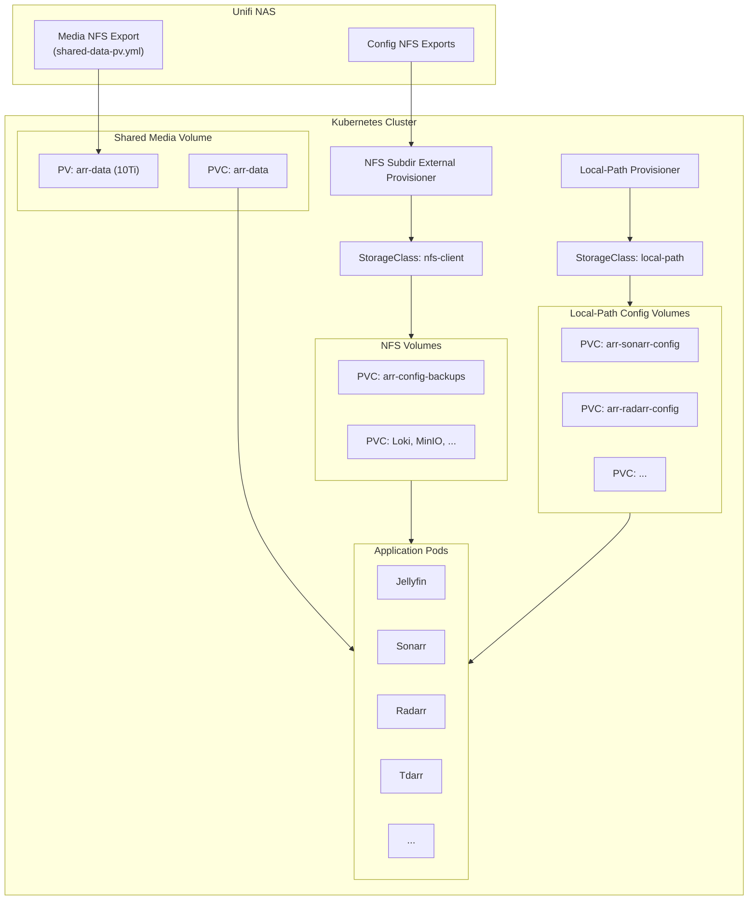

# Storage

This document covers the storage architecture, including the NFS dynamic provisioner, the shared media volume, per-application configuration volumes, and the NAS folder structure.

## Storage Architecture


```mermaid
flowchart TD
    subgraph nas["Unifi NAS"]
        nfsExport["Media NFS Export\n(shared-data-pv.yml)"]
        configExport["Config NFS Exports"]
    end

    subgraph k8sCluster["Kubernetes Cluster"]
        nfsProv["NFS Subdir External Provisioner"]
        localProv["Local-Path Provisioner"]
        scNfsClient["StorageClass: nfs-client"]
        scLocalPath["StorageClass: local-path"]

        subgraph sharedVol["Shared Media Volume"]
            arrPV["PV: arr-data (10Ti)"]
            arrPVC["PVC: arr-data"]
        end

        subgraph nfsVols["NFS Volumes"]
            backupPVC["PVC: arr-config-backups"]
            otherPVC["PVC: Loki, MinIO, ..."]
        end

        subgraph localVols["Local-Path Config Volumes"]
            sonarrPVC["PVC: arr-sonarr-config"]
            radarrPVC["PVC: arr-radarr-config"]
            moreLocalPVC["PVC: ..."]
        end

        subgraph appPods["Application Pods"]
            jellyfin["Jellyfin"]
            sonarr["Sonarr"]
            radarr["Radarr"]
            tdarr["Tdarr"]
            otherApps["..."]
        end
    end

    nfsExport --> arrPV
    configExport --> nfsProv
    nfsProv --> scNfsClient
    scNfsClient --> nfsVols
    localProv --> scLocalPath
    scLocalPath --> localVols
    arrPVC --> appPods
    nfsVols --> appPods
    localVols --> appPods
```

## Storage Provisioners

### NFS Subdir External Provisioner

The NFS Subdir External Provisioner dynamically creates PersistentVolumes backed by subdirectories on the Unifi NAS. It eliminates the need to manually pre-create PVs for each application.

| Setting | Value |
|---------|-------|
| StorageClass Name | `nfs-client` |
| NFS Server | Unifi NAS |
| Path Pattern | `${.PVC.namespace}-${.PVC.name}` |
| Reclaim Policy | Retain |

The `pathPattern` creates predictable directory names on the NAS. For example, a PVC named `arr-config-backups` in the `arr` namespace creates the NFS subdirectory `arr-arr-config-backups`.

!!! warning "Released PVs share directories with live ones"
    Because `pathPattern` derives the directory from the *claim* name, a deleted-and-recreated PVC of the same name reuses the same directory. `Retain` means the old PV stays `Released` while pointing at data the new PV is actively writing. Never delete the backing directory when cleaning up a `Released` PV without first confirming no `Bound` PV shares it.

!!! info "Default StorageClass"
    `nfs-client` serves as the default StorageClass for the cluster. Any PVC that does not specify a `storageClassName` will be provisioned by this provisioner.

### Local-Path Provisioner

The Rancher Local-Path Provisioner provides node-local storage for SQLite-backed applications. These run in WAL mode, which coordinates through a memory-mapped `-shm` file that SQLite does not support over a network filesystem, so their databases cannot live on NFS.

| Setting | Value |
|---------|-------|
| StorageClass Name | `local-path` |
| Volume Binding Mode | WaitForFirstConsumer |
| Reclaim Policy | Retain |
| Storage Path | `/opt/local-path-provisioner/` |

Local-path volumes are tied to the worker node where they are first provisioned. Applications using this StorageClass define their PVCs as standalone kustomize resources with `existingClaim` references in their Helm values.

!!! warning "Node Affinity"
    Pods using local-path PVCs are pinned to the node where the volume was created. If the node becomes unavailable, the pod cannot reschedule to another node until the original node recovers.

!!! danger "local-path volumes are not in any Velero backup"
    Velero's Kopia file-system backup cannot read `hostPath` volumes, which is what local-path provisions. Every PVC below is captured as a PVC and PV *object containing no data* -- a restore recreates them empty, and Velero logs this as a warning rather than an error, so the backup still reports success.

    Coverage comes from application-level dumps instead: `arr-config-backup` writes nightly SQLite `.backup` dumps (plus Tdarr's native archive) to an `nfs-client` volume, and `uptime-kuma-backup` does the same for `kuma.db`. Those NFS volumes *are* backed up. The Prometheus TSDB is deliberately excluded.

## Shared Media Volume (arr-data)

All media applications share a single 10Ti PersistentVolume backed by a dedicated NFS export on the Unifi NAS. This shared volume enables applications to access media files without copying data between volumes.

### Volume Specification

| Property | Value |
|----------|-------|
| PV Name | `arr-data` |
| Capacity | 10Ti |
| Access Mode | ReadWriteMany |
| NFS Path | Environment-specific (configured in `k8s/clusters/homelabk8s01/apps/arr/prereqs/shared-data-pv.yml`) |
| NFS Server | Unifi NAS (`192.168.1.158`) |
| PVC Name | `arr-data` |
| PVC Namespace | `arr` |

Each application mounts the shared PVC at `/data` within its pod, maintaining a consistent path structure that matches the NAS layout. This allows Sonarr, Radarr, and other apps to perform hardlinks and atomic moves instead of cross-device copies.

!!! tip "Hardlinks and Atomic Moves"
    Because all applications share the same underlying NFS mount, file operations like hardlinks and atomic moves work correctly. This is critical for the arr stack workflow where Sonarr/Radarr move completed downloads into the media library without duplicating data.

## NAS Folder Structure

The NAS follows the recommended media server folder structure, keeping downloads and library content under a single `/data` root:

```
/data/
  torrents/
    movies/
    tv/
    music/
    books/
  media/
    movies/
    tv/
    music/
    books/
```

### Path Mapping by Application

| Application | Mount Path | NAS Subdirectory Used |
|------------|-----------|----------------------|
| qBittorrent | `/data/torrents` | Torrent download destination |
| Sonarr | `/data` | Manages `/data/media/tv`, imports from `/data/torrents/tv` |
| Radarr | `/data` | Manages `/data/media/movies`, imports from `/data/torrents/movies` |
| Bazarr | `/data/media` | Reads media directories for subtitle matching |
| Jellyfin | `/data/media` | Serves content from media library |
| Tdarr | `/data/media` | Transcodes media files in-place |

## Per-Application Config Volumes

Each application has its own PVC for configuration and database storage. Every *arr app config volume is SQLite-backed and therefore uses `local-path`.

| Application | PVC Name | StorageClass | Size |
|------------|----------|-------------|------|
| Jellyfin | `arr-jellyfin-config` | `local-path` | 5Gi |
| Sonarr | `arr-sonarr-config` | `local-path` | 5Gi |
| Radarr | `arr-radarr-config` | `local-path` | 5Gi |
| Seerr | `arr-seerr-config` | `local-path` | 5Gi |
| Tdarr | `arr-tdarr-config` | `local-path` | 5Gi |
| Prowlarr | `arr-prowlarr-config` | `local-path` | 1Gi |
| Bazarr | `arr-bazarr-config` | `local-path` | 1Gi |
| Uptime Kuma | `uptime-kuma-data` | `local-path` | 1Gi |
| Config backups | `arr-config-backups` | `nfs-client` | 2Gi |

## Infrastructure Storage

| Component | PVC | StorageClass | Size | Purpose |
|-----------|-----|--------------|------|---------|
| Prometheus | `prometheus-data` | `local-path` | 20Gi | Metrics time-series data (15d retention) |
| Loki | `loki-data` | `nfs-client` | 10Gi | Log storage (168h retention) |
| Grafana | `grafana-data` | `nfs-client` | 2Gi | Dashboards and data source configuration |
| MinIO | `minio-data` | `nfs-client` | 50Gi | S3 backup object storage |
| etcd snapshots | `etcd-snapshots` | `nfs-client` | 1Gi | Nightly etcd snapshots + PKI tarballs |
| Authentik | PostgreSQL PVC | `nfs-client` | 5Gi | Identity provider database |
| Vault | Vault data PVC | `nfs-client` | 1Gi | KV v2 secret storage |

Prometheus is on `local-path` because heavy random TSDB I/O over NFS degrades queries and risks corruption. The trade-off is that it is pinned to a single node, unbounded in size, and -- like every local-path volume -- outside the backup path.
