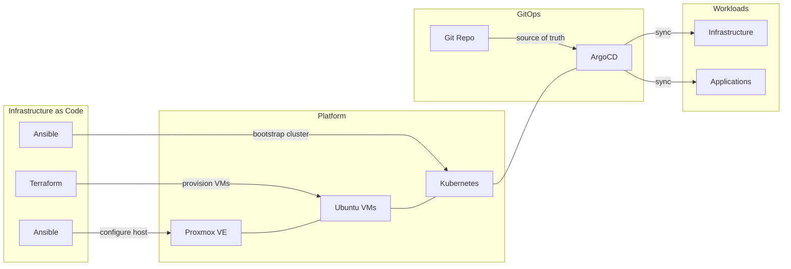

# Homelab

Infrastructure-as-code for a self-hosted Kubernetes homelab. Ansible configures Proxmox hosts, Terraform provisions VMs, Ansible bootstraps Kubernetes clusters, and ArgoCD manages workloads via GitOps.

## At a Glance

| Host | Hardware | Role | Clusters |
|------|----------|------|----------|
| homelabpve01 | Minisforum MS-01 (64GB) | Proxmox VE | homelabk8s01 |

| Cluster | Nodes | Purpose |
|---------|-------|---------|
| homelabk8s01 | 1 control plane + 2 workers | *arr media stack, Jellyfin |

## How It All Fits Together

## Documentation

| Section | What You'll Find |
|---------|-----------------|
| [Getting Started](getting-started/quick-start.md) | Prerequisites, deployment walkthrough, configuration reference |
| [Architecture](architecture/overview.md) | System design, GitOps flow, networking, storage, monitoring |
| [Apps](apps/index.md) | Per-app details for the *arr stack, Jellyfin, and Homepage |
| [Infrastructure](infrastructure/index.md) | Every infrastructure component: charts, config, and integration |
| [Runbooks](runbooks/disaster-recovery.md) | Operational procedures: DR, upgrades, troubleshooting |
| [Reference](reference/commands.md) | Makefile commands, service URLs, repo layout |

