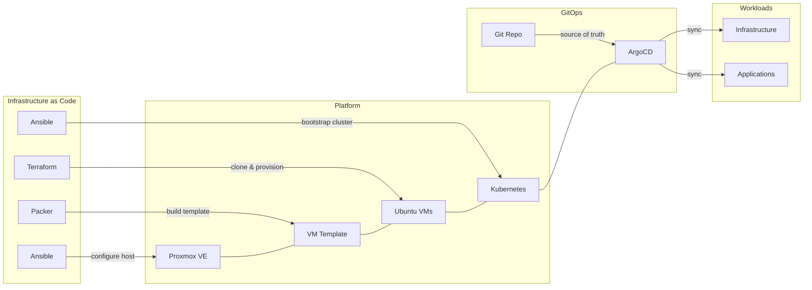

# Homelab

Infrastructure-as-code for a self-hosted Kubernetes homelab. Ansible configures Proxmox hosts, Packer builds VM templates, Terraform provisions VMs, Ansible bootstraps Kubernetes clusters, and ArgoCD manages workloads via GitOps.

## At a Glance

| Host | Hardware | Role | Clusters |
|------|----------|------|----------|
| homelabpve01 | [Minisforum MS-01](reference/hardware.md#minisforum-ms-01-homelabpve01) (i9-13900H, 64GB DDR5, 2TB NVMe) | Proxmox VE | homelabk8s01 |

| Cluster | Nodes | Purpose |
|---------|-------|---------|
| homelabk8s01 | [1 control plane + 2 workers](reference/hardware.md#kubernetes-vms) | *arr media stack, Jellyfin |

| Network | Details |
|---------|---------|
| Router | [UniFi Dream Router 7](architecture/network-infrastructure.md) |
| Switch | USW-16-PoE (16x GbE PoE + 2x 1G SFP) |
| Storage | [UNAS Pro](reference/hardware.md#unas-pro) (1x 8TB WD Red Plus, NFS) |
| VLANs | [Default (192.168.1.0/24), Homelab (192.168.10.0/24)](architecture/network-infrastructure.md#vlans) |

## How It All Fits Together

## Documentation

| Section | What You'll Find |
|---------|-----------------|
| [Getting Started](getting-started/quick-start.md) | Prerequisites, deployment walkthrough, configuration reference |
| [Architecture](architecture/overview.md) | System design, GitOps flow, networking, storage, monitoring |
| [Apps](apps/index.md) | Per-app details for the *arr stack, Jellyfin, Homepage, Exportarr, and Uptime Kuma |
| [Infrastructure](infrastructure/index.md) | Every infrastructure component: charts, config, and integration |
| [Runbooks](runbooks/disaster-recovery.md) | Operational procedures: DR, upgrades, troubleshooting |
| [Reference](reference/commands.md) | Makefile commands, service URLs, repo layout, hardware inventory |
| [Roadmap](roadmap/index.md) | Assessment, phased improvement plan, long-term vision |
