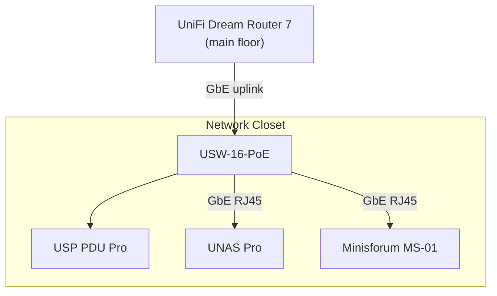

# Hardware Inventory

Physical hardware that makes up the homelab.

## Rack

### StarTech RK15WALLOA

Wall-mounted in a network closet. All equipment except the Dream Router 7 is installed here.

| Spec | Detail |
|------|--------|
| Model | RK15WALLOA |
| Type | 19" open-frame, 2-post wall-mount |
| Rack units | 15U |
| Depth | Adjustable 12-20" |
| Weight capacity | 198 lb (90 kg) |
| Material | SPCC cold-rolled steel |

## Rack Layout

The Dream Router 7 sits on the main floor and connects to the closet via a single Gigabit Ethernet uplink.

## Compute

### Minisforum MS-01 (homelabpve01)

Proxmox VE hypervisor. Runs all Kubernetes VMs.

| Spec | Detail |
|------|--------|
| Model | MS-01-S1390 (barebones) |
| CPU | Intel Core i9-13900H (6P+8E / 20T, up to 5.4 GHz, vPro Enterprise) |
| RAM | Crucial CT2K32G52S42U5 (2x32 GB DDR5-5200 SO-DIMM, dual-channel) |
| Storage | WD Black SN850X 2TB NVMe (PCIe 4.0 x4, M.2 2280 slot 1) |
| iGPU | Intel Iris Xe (i915, PCI 0000:00:02.0, passed through to K8s via VFIO) |
| NICs | 2x Intel X710 10G SFP+, 2x Intel i226-V 2.5G RJ45 |
| Expansion | 1x PCIe 4.0 x16 (half-height single-slot), 2x M.2 NVMe (slot 2: PCIe 3.0 x4, slot 3: PCIe 3.0 x2) |
| Other I/O | 2x USB4 (40 Gbps), 3x USB 3.2, 2x USB 2.0, HDMI 2.0 |
| Wireless | Intel AX211 (Wi-Fi 6E + Bluetooth 5.2) -- unused |
| Management | Intel AMT (vPro Enterprise) -- not configured |

**In use:** 1x 2.5G RJ45 to USW-16-PoE (negotiated at 1 Gbps). NVMe slot 1. iGPU via VFIO passthrough.

**Available:** 2x 10G SFP+, 1x 2.5G RJ45, PCIe x16 slot, 2x M.2 NVMe slots, Intel AMT.

#### VM Allocation

| Node | Role | vCPU | RAM | PCI Passthrough |
|------|------|------|-----|-----------------|
| homelabk8s01-node-1 | Control plane | 2 | 8 GB | -- |
| homelabk8s01-node-2 | Worker | 4 | 24 GB | -- |
| homelabk8s01-node-3 | Worker | 4 | 24 GB | Intel Iris Xe (i915) |

Total allocated: 10 vCPU / 56 GB of 14C / 64 GB physical.

## Networking

### UniFi Dream Router 7

Router, firewall, and UniFi Network controller. Located on the main floor with a Gigabit Ethernet uplink to the USW-16-PoE in the network closet.

| Spec | Detail |
|------|--------|
| Model | UDR7 |
| WAN | 1x 10G SFP+, 1x 2.5G RJ45 |
| LAN | 1x 2.5G RJ45 (WAN/LAN), 3x 2.5G RJ45 (1x PoE) |
| Wi-Fi | Tri-band Wi-Fi 7 (2.4 / 5 / 6 GHz, up to 10.6 Gbps aggregate) |
| IDS/IPS | 2.3 Gbps throughput |
| Storage | 64 GB microSD (pre-installed, UniFi Protect NVR) |
| Power | Internal 50W AC/DC, 26W max draw (excluding PoE) |

WireGuard VPN server and UniFi Teleport are enabled.

### USW-16-PoE

| Spec | Detail |
|------|--------|
| Model | USW-16-PoE |
| Ports | 16x GbE RJ45 (8x PoE+), 2x 1G SFP |
| PoE budget | 42W (802.3af/at, 32W max per port) |
| Switching capacity | 36 Gbps |

### U6 Extenders

Wi-Fi 6 access points deployed throughout the house. Plug into a standard wall outlet.

| Spec | Detail |
|------|--------|
| Model | U6-Extender |
| Wi-Fi | Dual-band Wi-Fi 6 (2.4 GHz 2x2 / 5 GHz 4x4, up to 5.3 Gbps aggregate) |
| Coverage | ~1,250 ft² per unit |
| Power | Wall outlet (100-240V AC) |

## Storage

### UNAS Pro

| Spec | Detail |
|------|--------|
| Drive bays | 4 (3.5" SATA) |
| Installed | 1x WD80EFPX (WD Red Plus 8 TB, 5640 RPM, 256 MB cache, CMR) |
| Pool | Single drive |
| Export | NFS at `192.168.1.158:/mnt/media` |
| Network | GbE RJ45 to USW-16-PoE |

Serves all NFS-backed PersistentVolumes for the Kubernetes cluster via the `nfs-client` StorageClass.

## Power

### USP PDU Pro

Per-outlet power monitoring and remote switching for all rack equipment. No UPS.

| Spec | Detail |
|------|--------|
| Model | USP-PDU-Pro |
| Outlets | 16x NEMA 5-15R (individually switchable, 125V/15A, 1875W max total) |
| USB | 4x USB-C (20W max total) |
| Network | 1x 100M RJ45, 3x GbE RJ45 |
| Rack size | 2U |
